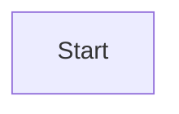
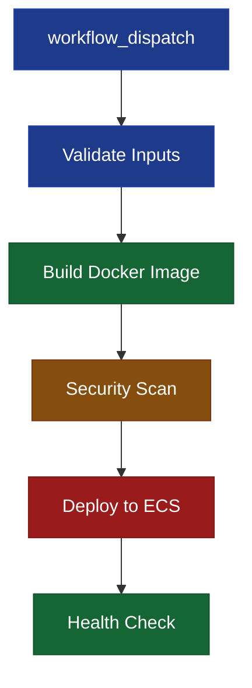
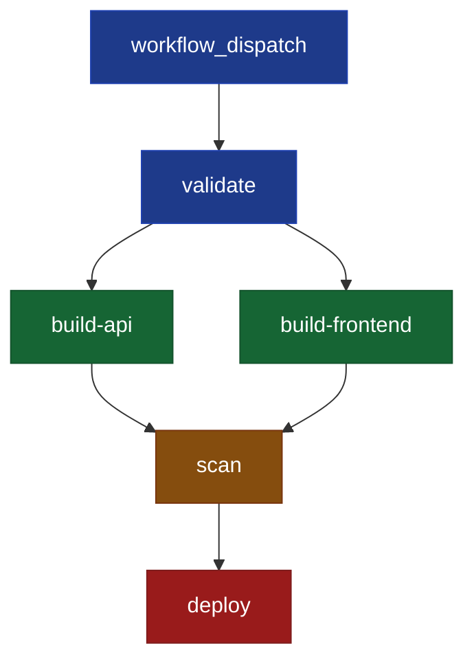

# Mermaid Diagram Compliance Skill

This skill ensures all mermaid diagrams in the repository conform to standards, render correctly on GitHub, and accurately represent the systems they document.

## When This Skill Is Invoked

This skill automatically activates when you:
- Update mermaid diagrams to conform to standards
- Fix mermaid diagram rendering issues
- Validate mermaid diagram accuracy
- Review mermaid diagrams for compliance
- Work with files containing mermaid code blocks

**Automatic Behavior:**
1. **Scan for diagrams:** Find all markdown files with mermaid code blocks
2. **Check init directives:** Detect and remove `%%{init:}` directives (breaks GitHub rendering)
3. **Validate syntax:** Use `mermaid-diagram-validator` tool
4. **Preview rendering:** Use `mermaid-diagram-preview` tool
5. **Verify accuracy:** For workflow diagrams, compare against YAML source
6. **Batch processing:** Process 5-10 files per commit
7. **Report results:** Document what was fixed and what issues remain

## Mermaid Standards for This Repository

### 1. No Init Directives (CRITICAL)

**Rule:** NEVER use `%%{init:}` directives in mermaid diagrams.

**Problem:** GitHub's mermaid renderer breaks when init directives are present:
- Node styles fail to apply (no colors, no borders)
- `classDef` statements are ignored
- Diagrams render without visual distinction between node types

**Solution:** Remove the entire init directive line:

```diff
# WRONG (breaks rendering)
```mermaid
- %%{init: {'theme':'base'}}%%
  flowchart TD
      node1[Start]:::startNode
```

# CORRECT (renders properly)

```

**Automatic Fix Process:**
1. Search mermaid code blocks for `%%{init:`
2. Delete the entire init directive line
3. Keep ALL `classDef` statements (they work without init)
4. Validate syntax with `mermaid-diagram-validator`
5. Preview with `mermaid-diagram-preview` to confirm rendering

### 2. Required Theme for Workflow Diagrams

All GitHub Actions workflow diagrams MUST use this standard theme and color scheme:

```mermaid
flowchart TD
    classDef triggerNode fill:#1e3a8a,stroke:#1e40af,color:#fff
    classDef startNode fill:#1e3a8a,stroke:#1e40af,color:#fff
    classDef criticalNode fill:#991b1b,stroke:#7f1d1d,color:#fff
    classDef warningNode fill:#854d0e,stroke:#78350f,color:#fff
    classDef successNode fill:#166534,stroke:#14532d,color:#fff
    classDef failureNode fill:#7f1d1d,stroke:#450a0a,color:#fff
    classDef endNode fill:#166534,stroke:#14532d,color:#fff
```

**Node Class Definitions:**

| Class | Color | Usage |
|-------|-------|-------|
| `triggerNode` | Blue (#1e3a8a) | Workflow triggers (workflow_dispatch, push, schedule) |
| `startNode` | Blue (#1e3a8a) | Initial setup jobs (checkout, validate inputs) |
| `criticalNode` | Red (#991b1b) | Critical operations (deployments, database changes) |
| `warningNode` | Orange (#854d0e) | Caution steps (security scans, approval gates) |
| `successNode` | Green (#166534) | Build, test, verification steps |
| `failureNode` | Dark Red (#7f1d1d) | Failure handlers, rollback steps |
| `endNode` | Green (#166534) | Final success states |

**Example Usage:**



### 3. Diagram Accuracy Requirements

For diagrams that represent code or systems (workflows, architecture, etc.), accuracy is MANDATORY:

#### For GitHub Actions Workflow Diagrams

**CRITICAL:** Diagrams MUST match the actual workflow YAML file exactly.

**Verification Process:**

1. **Read the source YAML:**
   ```bash
   cat .github/workflows/<workflow-name>.yml
   ```

2. **Extract job structure:**
   - Job IDs (exact names from `jobs:` section)
   - Job dependencies (`needs:` clauses)
   - Conditional logic (`if:` clauses)
   - Parallel vs sequential execution
   - Approval gates (workflow_call to approval handlers)

3. **Compare diagram to YAML:**
   - [ ] All jobs are shown in diagram
   - [ ] Job names match YAML exactly (not descriptions)
   - [ ] All `needs:` dependencies shown as arrows
   - [ ] Conditional branches shown (if: success(), if: failure())
   - [ ] Parallel jobs shown as separate branches
   - [ ] Node classes applied correctly

4. **Update if mismatched:**
   - Add missing jobs
   - Correct job names
   - Fix dependency arrows
   - Add conditional paths
   - Apply proper node classes

**Example - Matching Diagram to YAML:**

```yaml
# .github/workflows/deploy.yml
jobs:
  validate:
    runs-on: ubuntu-latest
    steps: [...]
  
  build-api:
    needs: validate
    runs-on: ubuntu-latest
    steps: [...]
  
  build-frontend:
    needs: validate
    runs-on: ubuntu-latest
    steps: [...]
  
  scan:
    needs: [build-api, build-frontend]
    runs-on: ubuntu-latest
    steps: [...]
  
  deploy:
    needs: scan
    runs-on: ubuntu-latest
    steps: [...]
```

**Correct Diagram (matches YAML):**



**Incorrect Diagram (doesn't match YAML):**

```mermaid
flowchart TD
    A[Start] --> B[Build]
    B --> C[Deploy]  
    # Missing: validate, build-api, build-frontend, scan jobs
    # Missing: parallel build branches
    # Missing: dependency relationships
```

### 4. Syntax Validation

**MANDATORY:** All diagrams MUST pass validation and preview before committing.

**Validation Workflow:**

```markdown
1. **Validate syntax:**
   - Use `mermaid-diagram-validator` tool
   - Fix any syntax errors reported
   - Verify node IDs are unique
   - Check for proper escaping of special characters

2. **Preview rendering:**
   - Use `mermaid-diagram-preview` tool
   - Verify colors and styles appear correctly
   - Check node positioning and arrows
   - Confirm text is readable

3. **Test complex diagrams:**
   - Visit https://mermaid.live
   - Paste diagram code
   - Verify rendering in live editor
   - Test edge cases (long labels, many nodes, etc.)
```

**Common Syntax Issues:**

| Issue | Fix |
|-------|-----|
| Special characters in labels | Wrap in quotes: `node1["Label with : special"]` |
| Duplicate node IDs | Use unique IDs: `build1`, `build2` vs `build`, `build` |
| Unclosed subgraphs | Add `end` for each `subgraph` |
| Invalid arrow syntax | Use `-->`, `-.->`, or `==>` not `->` or `~>` |
| Missing classDef before class usage | Define all classes before applying them |

### 5. Diagram Types Allowed

This repository uses these mermaid diagram types:

- **Flowcharts** (primary): GitHub Actions workflows, process flows
- **Sequence Diagrams**: API interactions, authentication flows
- **Architecture Diagrams**: System architecture, infrastructure layouts
- **ER Diagrams**: Database schemas (when applicable)

**Restricted Types:**
- Avoid Gantt charts (use GitHub Projects instead)
- Avoid pie charts (use markdown tables instead)
- Avoid class diagrams unless documenting actual code classes

## Compliance Checking Process

When invoked to check mermaid compliance:

### Step 1: Discover All Mermaid Diagrams

```bash
# Find all markdown files with mermaid code blocks
grep -rl "```mermaid" . --include="*.md" | grep -v node_modules | sort
```

### Step 2: Scan for Init Directives

```bash
# Find files with problematic init directives
grep -l "%%{init:" .github/workflows/docs/*.md 2>/dev/null || echo "None found"
```

### Step 3: Check Each Diagram

For each file with mermaid diagrams:

1. **Read the file**
2. **Extract mermaid code blocks**
3. **Check for init directives** - mark for removal
4. **Validate syntax** - use mermaid-diagram-validator
5. **For workflow diagrams** - compare to YAML source
6. **Document issues** - list what needs fixing

### Step 4: Fix Issues in Batches

Process 5-10 files per batch:

1. Remove init directives
2. Fix syntax errors
3. Update inaccurate diagrams
4. Validate all changes
5. Preview rendering
6. Commit batch with descriptive message

### Step 5: Generate Compliance Report

Create a report showing:
- Total diagrams checked
- Init directives removed
- Syntax errors fixed
- Accuracy issues corrected
- Remaining issues (if any)

**Example Report:**

```markdown
## Mermaid Compliance Report

**Date:** 2026-02-09  
**Files Scanned:** 15  
**Diagrams Found:** 12

### Issues Fixed

✅ **Init Directives Removed:** 5 files
- architecture-overview.md
- deployment-guide.md
- troubleshooting.md
- (2 more...)

✅ **Syntax Errors Fixed:** 2 files
- Fixed duplicate node IDs in deployment-workflow.md
- Fixed special character escaping in architecture.md

✅ **Accuracy Updated:** 3 files
- deployment-guide.md: Updated ECS cluster names
- architecture.md: Corrected RDS configuration
- (1 more...)

### Summary

- **12/12 diagrams validated** ✅
- **5/5 init directives removed** ✅  
- **2/2 syntax errors fixed** ✅
- **3/3 accuracy issues corrected** ✅

**Overall Status:** 100% compliant
```

## Common Tasks & Expected Behavior

### Task: "Fix mermaid diagrams to conform to standards"

**What the agent should do:**

1. Run discovery to find all mermaid diagrams
2. Scan for init directives and create fix list
3. Process in batches of 5-10 files:
   - Remove init directives
   - Validate syntax
   - Preview rendering
   - Commit batch
4. Generate compliance report
5. Open PR with all fixes

### Task: "Validate mermaid diagram accuracy in workflow docs"

**What the agent should do:**

1. List all workflow YAML files
2. For each workflow, read YAML and corresponding doc
3. Compare diagram to YAML:
   - Job names match
   - Dependencies correct
   - Conditionals shown
4. Update diagrams that don't match
5. Validate and preview
6. Commit with accuracy fixes

### Task: "Check mermaid compliance report"

**What the agent should do:**

1. Scan all markdown files
2. Validate each diagram
3. Generate detailed report (see format above)
4. Identify issues by severity
5. Present report to user

## Integration with Other Skills

**IMPORTANT:** This is a **leaf-level utility skill** that does NOT invoke other skills. It only performs mermaid diagram validation and fixes.

**How OTHER skills use THIS skill (inbound references only):**

- **workflow-docs skill**: References this skill for diagram validation during doc updates
- **Auto-fix workflows**: Can trigger this skill for scheduled diagram fixes
- **PR reviews**: Can invoke this skill to validate diagrams in pull requests

**Expected usage pattern (from other skills):**

When another skill (like workflow-docs) needs to validate/fix diagrams, it should:
1. Complete its primary work (e.g., update text sections)
2. Reference mermaid-compliance skill for diagram standards
3. Apply mermaid validation/fixing procedures
4. Continue with its workflow

**This skill does NOT:**
- Invoke workflow-docs or any other skills
- Update documentation content beyond mermaid code blocks
- Make decisions about when to run - it's always invoked by something else

## Tools Required

This skill requires these VS Code tools:

- `mermaid-diagram-validator`: Syntax validation
- `mermaid-diagram-preview`: Rendering preview
- `read_file`: Read source files (YAML, markdown)
- `replace_string_in_file`: Fix diagrams
- `grep_search`: Find diagrams across codebase
- `run_in_terminal`: Execute git commands

## Best Practices

1. **Always validate before preview** - catch syntax errors first
2. **Preview after every fix** - confirm rendering works
3. **Batch related changes** - group similar fixes together
4. **Descriptive commit messages** - explain what was fixed and why
5. **Test edge cases** - verify complex diagrams at mermaid.live
6. **Document manual review items** - flag issues that need human input
7. **Generate reports** - provide visibility into compliance status

## Quick Reference

**Find init directives:**
```bash
grep -l "%%{init:" .github/workflows/docs/*.md
```

**Remove init directive (example):**
```bash
sed -i '' "/%%{init: {'theme':'base'}}%%/d" file.md
```

**Validate diagram:**
```
Use mermaid-diagram-validator tool with diagram code
```

**Preview diagram:**
```
Use mermaid-diagram-preview tool with file path or code
```

**Test at mermaid.live:**
```
https://mermaid.live - paste code, verify rendering
```
