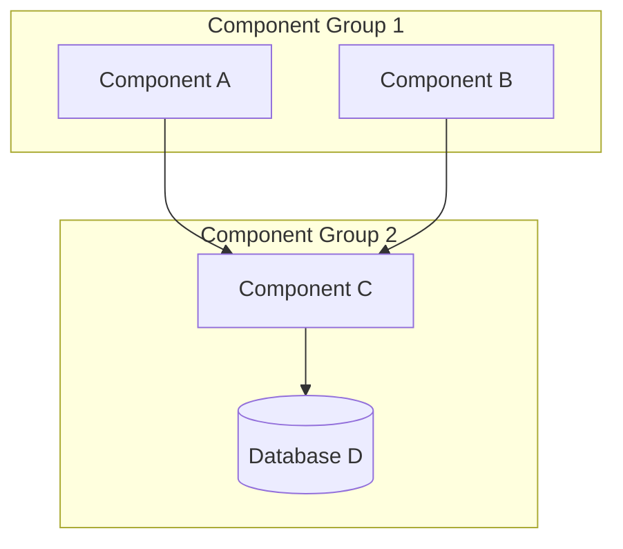
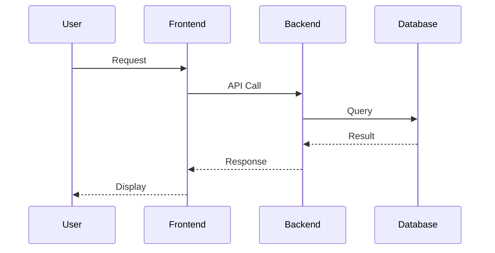

# [Service/System Name] Architecture

**Document Type**: Architecture  
**Last Updated**: YYYY-MM-DD  
**Status**: [Active|Draft|Proposed]  
**Owner**: [Team Name]  
**Review Cycle**: Quarterly

---

## Table of Contents

- [Overview](#overview)
- [Architecture Diagram](#architecture-diagram)
- [Components](#components)
- [Integration Points](#integration-points)
- [Data Flow](#data-flow)
- [Security Considerations](#security-considerations)
- [Trade-offs and Decisions](#trade-offs-and-decisions)
- [Future Considerations](#future-considerations)
- [Related Documentation](#related-documentation)

---

## Overview

### Purpose

[Brief description of what this system/service does - 2-3 sentences]

### Scope

[What is included and what is not included in this architecture - bullet points]

- **Included:**
  - Component A
  - Component B
  
- **Out of Scope:**
  - External system X
  - Future enhancement Y

### Key Requirements

- **Requirement 1**: [Description]
- **Requirement 2**: [Description]
- **Requirement 3**: [Description]

---

## Architecture Diagram

[Provide a high-level architecture diagram showing major components and their relationships]

**Diagram Description:**
[Provide a text description of the diagram for accessibility and clarity]

---

## Components

### Component A: [Name]

**Purpose**: [What this component does]

**Technology**: [AWS service, framework, language, etc.]

**Configuration**:
- Setting 1: Value
- Setting 2: Value

**Responsibilities**:
- Responsibility 1
- Responsibility 2

**Dependencies**:
- Component B (for X)
- External Service Y (for Z)

---

### Component B: [Name]

[Repeat structure for each major component]

---

## Integration Points

### External Services

| Service | Purpose | Protocol | Authentication |
|---------|---------|----------|----------------|
| Service A | Purpose description | REST/gRPC/etc | API Key/OAuth |
| Service B | Purpose description | REST/gRPC/etc | API Key/OAuth |

### Internal APIs

[Describe internal APIs, message queues, or other integration mechanisms]

---

## Data Flow

### Primary Data Flow

[Describe how data moves through the system]

### Key Data Paths

1. **Path 1**: [Description of data flow]
2. **Path 2**: [Description of data flow]

---

## Security Considerations

### Authentication & Authorization

[Describe how users/services authenticate and what authorization mechanisms are in place]

### Data Protection

**At Rest:**
- Encryption method: [e.g., AES-256]
- Key management: [e.g., AWS KMS]

**In Transit:**
- Protocol: [e.g., TLS 1.3]
- Certificate management: [e.g., AWS Certificate Manager]

### Network Security

- Security groups configuration
- VPC setup
- Network isolation strategies

### Compliance

- Data encryption at rest and in transit
- Security best practices: [specific measures]
- Other compliance requirements: [list]

---

## Trade-offs and Decisions

### Decision 1: [Decision Title]

**Context**: [Why this decision was needed]

**Decision**: [What was decided]

**Rationale**: [Why this approach was chosen]

**Alternatives Considered**:
- Alternative A: [Why not chosen]
- Alternative B: [Why not chosen]

**Consequences**:
- Positive: [Benefits]
- Negative: [Drawbacks or limitations]

---

### Decision 2: [Decision Title]

[Repeat structure for each major architectural decision]

---

## Scalability and Performance

### Current Capacity

- **Throughput**: [X requests/second, Y transactions/hour]
- **Latency**: [P50, P95, P99 metrics]
- **Concurrent users**: [Number or range]

### Scaling Strategy

- **Horizontal scaling**: [Approach]
- **Vertical scaling**: [Approach]
- **Auto-scaling**: [Configuration]

### Performance Optimization

- Optimization 1
- Optimization 2

---

## Reliability and Availability

### High Availability

- **Target uptime**: [e.g., 99.9%]
- **Redundancy**: [Multi-AZ, multi-region, etc.]
- **Failover strategy**: [Approach]

### Disaster Recovery

- **RTO**: [Recovery Time Objective]
- **RPO**: [Recovery Point Objective]
- **Backup strategy**: [Details]

### Monitoring and Alerting

- Key metrics monitored
- Alert thresholds
- On-call procedures

---

## Cost Considerations

### Current Cost

- **Monthly estimate**: $X,XXX
- **Breakdown**:
  - Component A: $XXX
  - Component B: $XXX

### Cost Optimization

- Optimization opportunity 1
- Optimization opportunity 2

---

## Future Considerations

### Planned Enhancements

1. **Enhancement 1**: [Description and timeline]
2. **Enhancement 2**: [Description and timeline]

### Known Limitations

- Limitation 1: [Description and potential mitigation]
- Limitation 2: [Description and potential mitigation]

### Technical Debt

- Debt item 1: [Description and remediation plan]
- Debt item 2: [Description and remediation plan]

---

## Related Documentation

**Prerequisites:**
- [Document 1](link)
- [Document 2](link)

**Runbooks and Operations:**
- [Deployment Runbook](link)
- [Disaster Recovery Runbook](link)

**Integration Guides:**
- [Service A Integration](link)
- [Service B Integration](link)

**Configuration Reference:**
- [Configuration Guide](link)

---

## Appendix

### Glossary

- **Term 1**: Definition
- **Term 2**: Definition

### References

- [External documentation link]
- [RFC or standard reference]
- [Related blog post or article]

---

**Maintained by:** [Team Name]  
**Questions:** Contact [team email or Slack channel]
