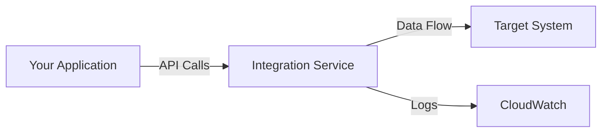

# [Service Name] Integration Guide

**Document Type**: Integration Guide  
**Last Updated**: YYYY-MM-DD  
**Status**: Active  
**Owner**: [Team Name]  
**Review Cycle**: Quarterly or after API changes

---

## Table of Contents

- [Overview](#overview)
- [Prerequisites](#prerequisites)
- [Architecture](#architecture)
- [Setup and Configuration](#setup-and-configuration)
- [Authentication and Authorization](#authentication-and-authorization)
- [API Reference](#api-reference)
- [Code Examples](#code-examples)
- [Testing and Validation](#testing-and-validation)
- [Error Handling](#error-handling)
- [Monitoring and Maintenance](#monitoring-and-maintenance)
- [Troubleshooting](#troubleshooting)
- [Related Documentation](#related-documentation)

---

## Overview

### Service Description

[Brief description of the service being integrated - 2-3 sentences]

### Integration Purpose

[What this integration accomplishes and why it's needed]

### Use Cases

- **Use Case 1**: [Description]
- **Use Case 2**: [Description]
- **Use Case 3**: [Description]

### Integration Type

- [ ] REST API
- [ ] GraphQL
- [ ] Message Queue
- [ ] Database
- [ ] SDK/Library
- [ ] Webhook
- [ ] Other: [specify]

---

## Prerequisites

### Required Access

- [ ] AWS Console access with permissions: [list]
- [ ] Service account credentials
- [ ] API keys or tokens
- [ ] [Other access requirements]

### Required Services

- [ ] Service A is configured
- [ ] Service B is running
- [ ] Network connectivity verified

### Required Tools

- [ ] AWS CLI v2.x+
- [ ] [SDK/CLI tool name] v[version]+
- [ ] [Other tools]

### Required Knowledge

- Familiarity with [concept 1]
- Understanding of [technology 2]

---

## Architecture

### Integration Architecture

[Provide a diagram showing how the integration fits into the overall system]



**Description:**
[Explain the integration flow and key components]

### Data Flow

1. **Step 1**: [Application action]
2. **Step 2**: [Integration processing]
3. **Step 3**: [Target system response]

### Components

| Component | Purpose | Technology |
|-----------|---------|------------|
| Component A | [Purpose] | [Tech] |
| Component B | [Purpose] | [Tech] |

---

## Setup and Configuration

### Step 1: Create Service Account

[Instructions for creating necessary accounts or IAM roles]

```bash
# Create IAM role
aws iam create-role --role-name ServiceIntegrationRole --assume-role-policy-document file://trust-policy.json

# Attach policy
aws iam attach-role-policy --role-name ServiceIntegrationRole --policy-arn arn:aws:iam::aws:policy/PolicyName
```

**Verification:**
- [ ] Role created successfully
- [ ] Permissions attached

---

### Step 2: Configure Service Settings

[Configuration steps with commands or UI instructions]

**Via Terraform:**
```hcl
resource "aws_service_resource" "integration" {
  name          = "integration-name"
  configuration = {
    setting1 = "value1"
    setting2 = "value2"
  }
}
```

**Via AWS Console:**
1. Navigate to [Service Console]
2. Click [Button/Menu item]
3. Configure settings:
   - Setting 1: [value]
   - Setting 2: [value]

**Verification:**
- [ ] Configuration applied
- [ ] Settings visible in console

---

### Step 3: Set Up Environment Variables

Required environment variables:

```bash
# Add to .env or GitHub Secrets
SERVICE_API_KEY="your-api-key"
SERVICE_ENDPOINT="https://api.service.com"
SERVICE_REGION="us-east-1"
```

**For production**, store in AWS Secrets Manager:

```bash
aws secretsmanager create-secret \
  --name prod/service-integration \
  --secret-string '{"api_key":"key","endpoint":"url"}'
```

---

### Step 4: Install Dependencies

**For Node.js:**
```bash
npm install @service/sdk
```

**For Python:**
```bash
pip install service-sdk
```

**For other languages:**
[Language-specific installation instructions]

---

## Authentication and Authorization

### Authentication Method

[Describe the authentication method used]

- [ ] API Key
- [ ] OAuth 2.0
- [ ] JWT
- [ ] IAM Role
- [ ] Other: [specify]

### Obtaining Credentials

**API Key:**
```bash
# Generate API key
command to generate key
```

**OAuth 2.0:**
```bash
# Get access token
curl -X POST https://auth.service.com/oauth/token \
  -H "Content-Type: application/json" \
  -d '{"client_id":"ID","client_secret":"SECRET","grant_type":"client_credentials"}'
```

### Credential Management

Store credentials securely:

```bash
# Store in Secrets Manager
aws secretsmanager create-secret \
  --name service/credentials \
  --secret-string '{"api_key":"KEY"}'
```

### Rotating Credentials

[Instructions for credential rotation]

- **Rotation Schedule**: [e.g., every 90 days]
- **Rotation Procedure**: [Link to runbook or steps]

---

## API Reference

### Base URL

```
Production: https://api.service.com/v1
Staging: https://staging-api.service.com/v1
```

### Common Headers

```http
Content-Type: application/json
Authorization: Bearer {access_token}
X-API-Key: {api_key}
```

### Endpoints

#### GET /resource

**Purpose**: Retrieve resource data

**Request:**
```http
GET /resource/{id}
Authorization: Bearer {token}
```

**Response:**
```json
{
  "id": "resource-id",
  "data": "resource-data",
  "status": "active"
}
```

**Status Codes:**
- `200`: Success
- `404`: Resource not found
- `401`: Unauthorized
- `500`: Server error

---

#### POST /resource

**Purpose**: Create a new resource

**Request:**
```http
POST /resource
Authorization: Bearer {token}
Content-Type: application/json

{
  "name": "resource-name",
  "type": "resource-type"
}
```

**Response:**
```json
{
  "id": "new-resource-id",
  "status": "created"
}
```

**Status Codes:**
- `201`: Created
- `400`: Bad request
- `401`: Unauthorized

---

[Continue for all major endpoints]

---

## Code Examples

### Initialize Client

**Python:**
```python
from service_sdk import ServiceClient

client = ServiceClient(
    api_key=os.environ['SERVICE_API_KEY'],
    endpoint=os.environ['SERVICE_ENDPOINT']
)
```

**Node.js:**
```javascript
const ServiceClient = require('@service/sdk');

const client = new ServiceClient({
  apiKey: process.env.SERVICE_API_KEY,
  endpoint: process.env.SERVICE_ENDPOINT
});
```

---

### Example 1: Retrieve Data

**Python:**
```python
try:
    response = client.get_resource(resource_id="123")
    print(f"Resource data: {response['data']}")
except ServiceException as e:
    print(f"Error: {e.message}")
```

**Node.js:**
```javascript
try {
  const response = await client.getResource('123');
  console.log(`Resource data: ${response.data}`);
} catch (error) {
  console.error(`Error: ${error.message}`);
}
```

---

### Example 2: Create Resource

**Python:**
```python
new_resource = client.create_resource(
    name="My Resource",
    type="standard",
    attributes={
        "attr1": "value1",
        "attr2": "value2"
    }
)
print(f"Created resource: {new_resource['id']}")
```

---

### Example 3: Handle Pagination

**Python:**
```python
page = 1
while True:
    response = client.list_resources(page=page, per_page=100)
    
    for resource in response['items']:
        process_resource(resource)
    
    if not response['has_next']:
        break
    
    page += 1
```

---

### Example 4: Error Handling

**Python:**
```python
from service_sdk import ServiceException, RateLimitException

try:
    response = client.api_call()
except RateLimitException as e:
    # Handle rate limiting
    time.sleep(e.retry_after)
    response = client.api_call()
except ServiceException as e:
    # Handle general errors
    logger.error(f"API error: {e.message}")
    raise
```

---

## Testing and Validation

### Test Environment

Configure test environment:

```bash
export SERVICE_ENDPOINT="https://staging-api.service.com"
export SERVICE_API_KEY="test-key"
```

### Unit Tests

```python
import unittest
from unittest.mock import patch

class TestServiceIntegration(unittest.TestCase):
    @patch('service_sdk.ServiceClient')
    def test_create_resource(self, mock_client):
        mock_client.return_value.create_resource.return_value = {
            'id': 'test-id',
            'status': 'created'
        }
        
        result = create_resource("test")
        self.assertEqual(result['status'], 'created')
```

### Integration Tests

```bash
# Run integration tests
python -m pytest tests/integration/test_service.py -v
```

### Validation Checklist

After integration:

- [ ] Can authenticate successfully
- [ ] Can retrieve data
- [ ] Can create resources
- [ ] Error handling works
- [ ] Rate limiting handled
- [ ] Logging configured
- [ ] Monitoring set up

---

## Error Handling

### Common Errors

#### Error: "Authentication failed"

**Cause**: Invalid or expired credentials

**Resolution**:
```bash
# Verify credentials
echo $SERVICE_API_KEY

# Regenerate if needed
command to regenerate
```

---

#### Error: "Rate limit exceeded"

**Cause**: Too many requests

**Resolution**:
- Implement exponential backoff
- Add request throttling
- Increase rate limit if possible

```python
import time
from functools import wraps

def retry_on_rate_limit(max_retries=3):
    def decorator(func):
        @wraps(func)
        def wrapper(*args, **kwargs):
            for attempt in range(max_retries):
                try:
                    return func(*args, **kwargs)
                except RateLimitException as e:
                    if attempt < max_retries - 1:
                        time.sleep(2 ** attempt)
                    else:
                        raise
        return wrapper
    return decorator
```

---

#### Error: "Connection timeout"

**Cause**: Network issues or service unavailable

**Resolution**:
- Check network connectivity
- Verify service status
- Increase timeout values

---

### Error Response Format

Standard error response:

```json
{
  "error": {
    "code": "ERROR_CODE",
    "message": "Human readable message",
    "details": {
      "field": "additional info"
    }
  }
}
```

---

## Monitoring and Maintenance

### Key Metrics

Monitor these metrics:

| Metric | Threshold | Alert |
|--------|-----------|-------|
| Success rate | > 99% | < 95% |
| Response time | < 500ms | > 2s |
| Error rate | < 1% | > 5% |
| API quota usage | < 80% | > 90% |

### CloudWatch Metrics

```bash
# Create custom metric
aws cloudwatch put-metric-data \
  --namespace "ServiceIntegration" \
  --metric-name "APICallSuccess" \
  --value 1
```

### Logging

Configure structured logging:

```python
import logging

logger = logging.getLogger('service_integration')
logger.setLevel(logging.INFO)

logger.info('API call', extra={
    'endpoint': '/resource',
    'status_code': 200,
    'response_time_ms': 150
})
```

### Maintenance Tasks

Regular maintenance:

- [ ] **Weekly**: Review error logs
- [ ] **Monthly**: Check API quotas
- [ ] **Quarterly**: Rotate credentials
- [ ] **Quarterly**: Review and update documentation

---

## Troubleshooting

See the [Troubleshooting section](#error-handling) above for common issues.

For debugging:

```bash
# Enable debug logging
export SERVICE_DEBUG=true

# Test connectivity
curl -v https://api.service.com/health

# Check credentials
command to verify credentials
```

**Additional Resources:**
- [Service Status Page](https://status.service.com)
- [Service Support](mailto:support@service.com)
- [Internal Troubleshooting Guide](link)

---

## Related Documentation

**Prerequisites:**
- [Environment Setup](link)
- [AWS Configuration](link)

**Related Integrations:**
- [Related Service A Integration](link)
- [Related Service B Integration](link)

**Architecture:**
- [System Architecture](link)

**Operations:**
- [Deployment Runbook](link)
- [Monitoring Guide](link)

---

## Changelog

| Date | Version | Changes | Author |
|------|---------|---------|--------|
| YYYY-MM-DD | 1.0 | Initial integration | [Name] |
| YYYY-MM-DD | 1.1 | Added error handling | [Name] |

---

## Appendix

### Rate Limits

| Endpoint | Limit | Window |
|----------|-------|--------|
| GET /resource | 1000 | 1 hour |
| POST /resource | 100 | 1 hour |

### API Changelog

**v1.2 (YYYY-MM-DD):**
- Added new field `fieldX`
- Deprecated `oldField`

**v1.1 (YYYY-MM-DD):**
- Initial release

---

**Maintained by:** [Team Name]  
**Questions:** Contact [team email or Slack channel]  
**Service Support:** [support contact]
