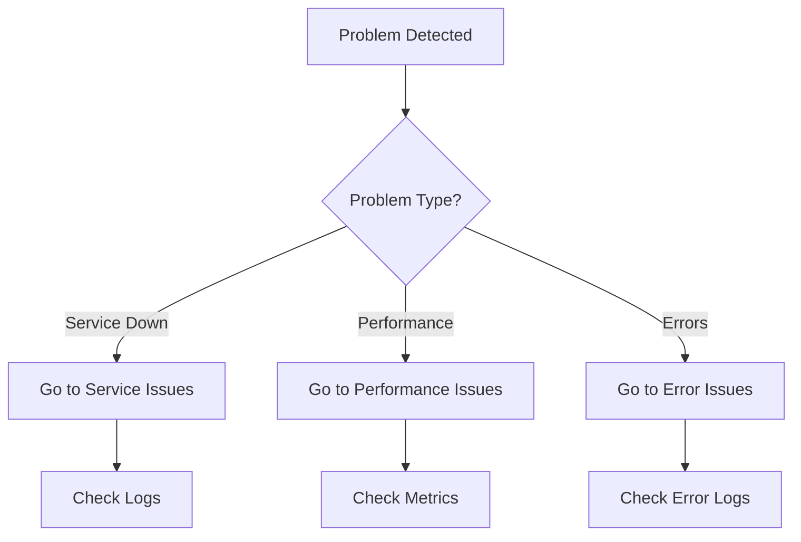

# [Problem/Service] Troubleshooting Guide

**Document Type**: Troubleshooting Guide  
**Last Updated**: YYYY-MM-DD  
**Status**: Active  
**Owner**: [Team Name]  
**Review Cycle**: After major incidents

---

## Table of Contents

- [Overview](#overview)
- [Quick Diagnostics](#quick-diagnostics)
- [Common Issues](#common-issues)
- [Component-Specific Issues](#component-specific-issues)
- [Root Cause Analysis](#root-cause-analysis)
- [Prevention Measures](#prevention-measures)
- [Getting Help](#getting-help)
- [Related Documentation](#related-documentation)

---

## Overview

### Purpose

[Brief description of what this guide helps troubleshoot]

### Scope

This guide covers issues related to:
- Problem area 1
- Problem area 2
- Problem area 3

**Not covered:**
- Out of scope item 1
- Out of scope item 2

### When to Use

Use this guide when you encounter:
- Symptom 1
- Symptom 2
- Symptom 3

---

## Quick Diagnostics

### Health Check Commands

Run these commands first to get an overview:

```bash
# Check service status
command to check service

# Check logs for errors
command to check logs

# Check resource utilization
command to check resources
```

### Decision Tree



### Key Metrics to Check

| Metric | Command | Normal Range | Issue If |
|--------|---------|--------------|----------|
| CPU Usage | `command` | < 70% | > 90% |
| Memory | `command` | < 80% | > 95% |
| Error Rate | `command` | < 0.1% | > 1% |
| Response Time | `command` | < 500ms | > 2s |

---

## Common Issues

### Issue 1: [Problem Title]

**Symptoms:**
- Visible symptom 1
- Visible symptom 2
- Error message: `error text`

**Severity**: [Critical|High|Medium|Low]

**Affected Components:**
- Component A
- Component B

**Possible Causes:**
1. Cause 1: [Description]
2. Cause 2: [Description]
3. Cause 3: [Description]

**Diagnosis Steps:**

1. **Check [something]:**
   ```bash
   diagnostic command
   ```
   
   **Expected result**: [Description]
   
   If result shows [X], then [conclusion].

2. **Verify [something else]:**
   ```bash
   another diagnostic command
   ```
   
   **Expected result**: [Description]

**Resolution:**

#### For Cause 1:

```bash
# Step 1: Description
resolution command 1

# Step 2: Description  
resolution command 2
```

**Verification:**
- [ ] Service responding normally
- [ ] No errors in logs
- [ ] Metrics back to normal

#### For Cause 2:

[Repeat resolution structure]

**Prevention:**
- Preventive measure 1
- Preventive measure 2

**Related Incidents:**
- Incident #123 (YYYY-MM-DD)
- Incident #456 (YYYY-MM-DD)

---

### Issue 2: [Problem Title]

[Repeat structure for each common issue]

---

### Issue 3: [Problem Title]

[Continue for all common issues]

---

## Component-Specific Issues

### Component A: [Name]

#### Symptom: [Specific Problem]

**Diagnosis:**
```bash
component-specific diagnostic
```

**Resolution:**
```bash
component-specific fix
```

**Logs to Check:**
- Log location 1: `path/to/logs`
- Log location 2: `path/to/logs`

---

### Component B: [Name]

[Repeat structure for each major component]

---

## Root Cause Analysis

### Investigation Steps

When the immediate issue is resolved but you need to understand root cause:

1. **Collect timeline data:**
   ```bash
   command to get timeline
   ```

2. **Check related systems:**
   - System A logs
   - System B metrics
   - External service status

3. **Review changes:**
   ```bash
   # Check recent deployments
   git log --since="24 hours ago"
   
   # Check infrastructure changes
   terraform show
   ```

4. **Analyze patterns:**
   - Check if issue is recurring
   - Look for patterns in timing
   - Correlate with other events

### Common Root Causes

#### Resource Exhaustion

**Symptoms:**
- Gradual performance degradation
- Increasing error rates
- High utilization metrics

**Investigation:**
```bash
# Check resource trends
monitoring command
```

**Resolution:**
- Short-term: Scale resources
- Long-term: Optimize usage patterns

---

#### Configuration Issues

**Symptoms:**
- Sudden failures after changes
- Inconsistent behavior
- Environment-specific issues

**Investigation:**
```bash
# Compare configurations
diff command
```

**Resolution:**
- Revert problematic config
- Test changes in staging first

---

#### External Dependencies

**Symptoms:**
- Timeout errors
- Intermittent failures
- Correlated with external service issues

**Investigation:**
- Check external service status pages
- Review API error rates
- Test connectivity

**Resolution:**
- Implement retry logic
- Add circuit breakers
- Set up fallbacks

---

## Error Messages Reference

### Error: "[Error Message 1]"

**Meaning**: [Plain language explanation]

**Common Causes:**
- Cause A
- Cause B

**Quick Fix:**
```bash
fix command
```

**See**: [Link to detailed issue section]

---

### Error: "[Error Message 2]"

[Repeat structure for common error messages]

---

## Performance Issues

### Slow Response Times

**Diagnosis:**
```bash
# Measure response times
performance diagnostic command

# Check database query times
database diagnostic command
```

**Common Causes:**
- Database slow queries
- Unoptimized code paths
- Resource constraints
- Network latency

**Resolution Approaches:**

1. **Database optimization:**
   ```sql
   -- Identify slow queries
   EXPLAIN ANALYZE query;
   ```

2. **Code optimization:**
   - Profile application
   - Identify bottlenecks
   - Optimize hot paths

3. **Infrastructure scaling:**
   - Increase resources
   - Add caching
   - Use CDN

---

### High Resource Usage

**Diagnosis:**
```bash
# Check resource usage
resource monitoring command
```

**Resolution:**
[Steps to address high usage]

---

## Network and Connectivity Issues

### Connection Timeouts

**Symptoms:**
- Timeout errors in logs
- Failed health checks
- Intermittent connectivity

**Diagnosis:**
```bash
# Test connectivity
connectivity test command

# Check security groups
security group check command

# Verify DNS
dns check command
```

**Resolution:**
[Steps to fix connectivity]

---

## Database Issues

### Connection Pool Exhaustion

**Symptoms:**
- "Too many connections" errors
- Waiting for connection timeout
- Application hangs

**Diagnosis:**
```sql
-- Check active connections
SHOW PROCESSLIST;
```

**Resolution:**
[Steps to handle connection issues]

---

## Prevention Measures

### Monitoring and Alerting

Set up alerts for:
- Error rate > threshold
- Response time > threshold
- Resource usage > threshold
- Service health checks failing

### Regular Maintenance

Schedule regular:
- [ ] Log reviews (daily/weekly)
- [ ] Metric analysis (weekly)
- [ ] Capacity planning (monthly)
- [ ] Performance testing (monthly)

### Infrastructure Best Practices

- Implement auto-scaling
- Use health checks
- Configure retry policies
- Set up circuit breakers
- Maintain redundancy

### Code Best Practices

- Add proper error handling
- Implement logging
- Use connection pooling
- Add request timeouts
- Write integration tests

---

## Getting Help

### Self-Service Resources

- **Documentation**: [Main docs link]
- **FAQ**: [FAQ link]
- **Known Issues**: [Issue tracker link]

### Escalation Path

1. **Level 1**: Check this guide and runbooks
2. **Level 2**: Team Slack channel: [#channel]
3. **Level 3**: On-call engineer: [contact method]
4. **Level 4**: Escalation to: [team lead contact]

### Creating Support Tickets

When creating a ticket, include:
- [ ] Problem description
- [ ] Steps already taken
- [ ] Error messages and logs
- [ ] Environment information
- [ ] Impact assessment
- [ ] Urgency level

Template:
```
Problem: [Description]
Environment: [staging/production]
Time observed: [Timestamp]
Symptoms: [List]
Steps taken: [List]
Logs: [Attach or paste]
```

---

## Related Documentation

**Runbooks:**
- [Deployment Runbook](link)
- [Recovery Runbook](link)

**Architecture:**
- [System Architecture](link)

**Configuration:**
- [Configuration Reference](link)

**Monitoring:**
- [Monitoring Dashboard](link)
- [Alert Definitions](link)

---

## Appendix

### Useful Commands

Quick reference:

```bash
# Restart service
restart command

# View logs
log command

# Check status
status command

# Scale resources
scaling command
```

### Log Locations

| Component | Log Path | Format |
|-----------|----------|--------|
| API | `/path/to/api.log` | JSON |
| Database | `/path/to/db.log` | Text |
| Worker | `/path/to/worker.log` | JSON |

### Monitoring Dashboards

- **Main Dashboard**: [URL]
- **Infrastructure**: [URL]
- **Application**: [URL]

---

## Changelog

| Date | Version | Changes | Author |
|------|---------|---------|--------|
| YYYY-MM-DD | 1.0 | Initial version | [Name] |
| YYYY-MM-DD | 1.1 | Added Issue #5 | [Name] |

---

**Maintained by:** [Team Name]  
**Questions:** Contact [team email or Slack channel]  
**Emergency:** [Emergency contact procedure]
