# Mermaid Diagram Guidelines for OpenEMR on ECS

Standards for creating and maintaining Mermaid diagrams in OpenEMR on ECS documentation.

## General Principles

1. **One concept per diagram** - Keep diagrams focused
2. **Consistent styling** - Use standard themes and colors
3. **No init directives** - NEVER use `%%{init:...}%%` blocks (breaks GitHub rendering)
4. **Validate before commit** - Always run mermaid-diagram-validator
5. **Preview before commit** - Always run mermaid-diagram-preview
6. **Text descriptions** - Supplement diagrams with text for accessibility

## GitHub Rendering Compliance (CRITICAL)

### Why Init Directives Break GitHub

**NEVER use `%%{init:}` directives** in mermaid diagrams for this repository.

**The Problem:**
GitHub's mermaid renderer has a critical incompatibility with init directives:
- Node styles fail to apply (no colors, no borders)
- `classDef` statements are completely ignored
- Diagrams render as plain text boxes without visual distinction
- All custom theming is lost

**The Solution:**
Remove init directives entirely. `classDef` statements work perfectly on GitHub **without** init directives.

❌ **WRONG (breaks on GitHub):**


✅ **CORRECT (renders properly on GitHub):**


### Standard Color Scheme for Workflow Diagrams

**MANDATORY:** All GitHub Actions workflow diagrams must use this standard theme:

```mermaid
flowchart TD
    classDef triggerNode fill:#1e3a8a,stroke:#1e40af,color:#fff
    classDef startNode fill:#1e3a8a,stroke:#1e40af,color:#fff
    classDef criticalNode fill:#991b1b,stroke:#7f1d1d,color:#fff
    classDef warningNode fill:#854d0e,stroke:#78350f,color:#fff
    classDef successNode fill:#166534,stroke:#14532d,color:#fff
    classDef failureNode fill:#7f1d1d,stroke:#450a0a,color:#fff
    classDef endNode fill:#166534,stroke:#14532d,color:#fff
```

**Node Class Reference:**

| Class | Color | Hex Code | Usage |
|-------|-------|----------|-------|
| `triggerNode` | Deep Blue | `#1e3a8a` | Workflow triggers (workflow_dispatch, push, schedule) |
| `startNode` | Deep Blue | `#1e3a8a` | Initial setup jobs (checkout, validate inputs) |
| `criticalNode` | Dark Red | `#991b1b` | Critical operations (deployments, database changes) |
| `warningNode` | Dark Orange | `#854d0e` | Caution steps (security scans, approval gates) |
| `successNode` | Dark Green | `#166534` | Build, test, verification steps |
| `failureNode` | Darkest Red | `#7f1d1d` | Failure handlers, rollback steps |
| `endNode` | Dark Green | `#166534` | Final success states |

**Example with Standard Colors:**

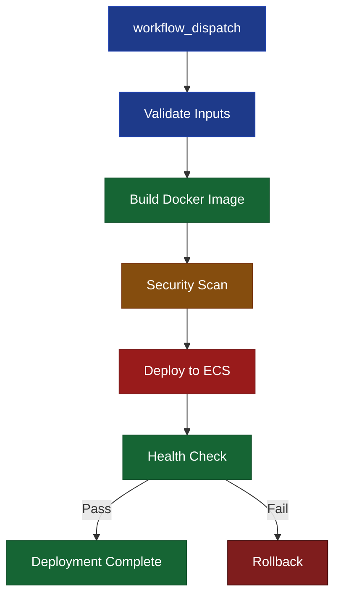

## Diagram Types

### Flowchart

Use for decision trees, workflows, and process flows:

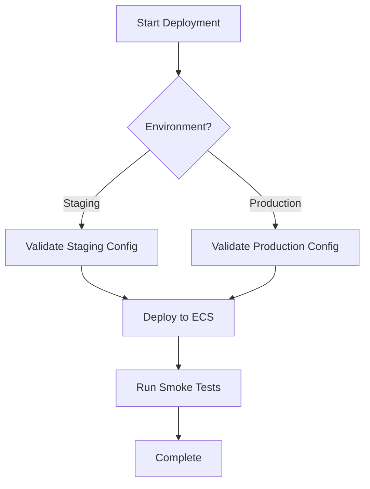

**When to use:**
- Deployment workflows
- Decision logic
- Error handling flows
- Multi-step processes

### Sequence Diagram

Use for interactions between systems/components:

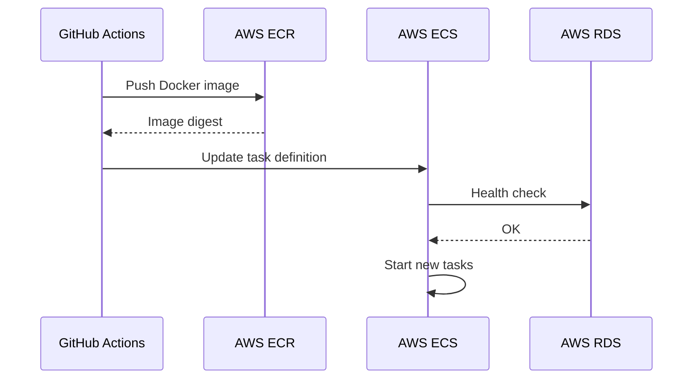

**When to use:**
- API interactions
- Authentication flows
- Deployment sequences
- Service communication

### Architecture Diagram (C4)

Use for system architecture and components:

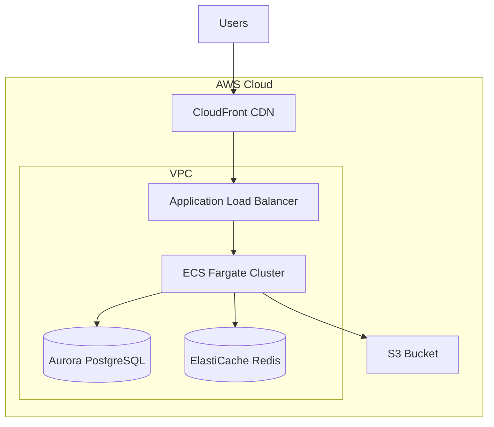

**When to use:**
- AWS infrastructure layout
- Component relationships
- Network topology
- Multi-tier architectures

### State Diagram

Use for status transitions and state machines:

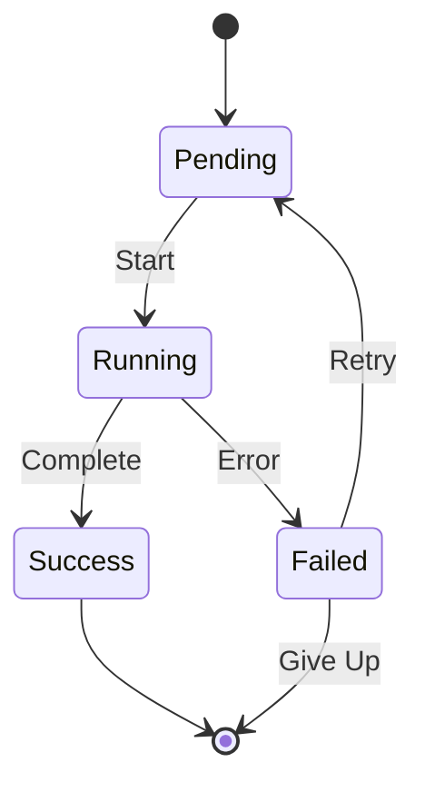

**When to use:**
- Deployment states
- Task statuses
- Workflow states
- Resource lifecycles

### Gantt Chart

Use for project timelines and scheduling:

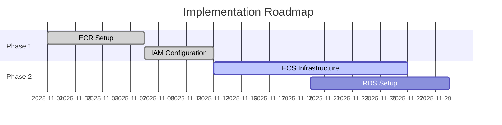

**When to use:**
- Project roadmaps
- Implementation timelines
- Maintenance schedules

## Styling Standards

### Colors for Workflow Diagrams

**Use the standard workflow color scheme** (see GitHub Rendering Compliance section above):

- **Trigger/Start**: `#1e3a8a` (deep blue)
- **Success/Build**: `#166534` (dark green)
- **Critical/Deploy**: `#991b1b` (dark red)
- **Warning/Caution**: `#854d0e` (dark orange)
- **Failure/Rollback**: `#7f1d1d` (darkest red)

### Colors for Other Diagram Types

For non-workflow diagrams (architecture, sequence, etc.), use semantic colors:

- **Success/Active**: `#28a745` (green)
- **Warning**: `#ffc107` (yellow)
- **Error/Critical**: `#dc3545` (red)
- **Info/Default**: `#007bff` (blue)
- **Neutral**: `#6c757d` (gray)

### Node Styles

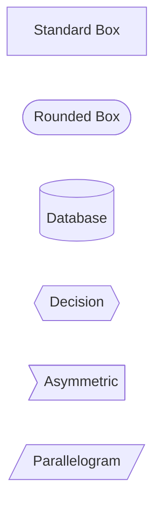

**Conventions:**
- **Databases**: Use cylinder `[()]`
- **Decisions**: Use diamond `{{}}`
- **Services**: Use rounded box `([])`
- **Actions**: Use standard box `[]`
- **External systems**: Use parallelogram `[//]`

### Arrow Types

- **Solid arrow** `-->`: Standard flow
- **Dotted arrow** `-.->`: Optional or async
- **Thick arrow** `==>`: Primary path
- **Arrow with text** `-->|label|`: Labeled transition

## Size and Complexity

### Recommended Limits

- **Max nodes**: 15-20 per diagram
- **Max depth**: 4-5 levels
- **Max width**: Readable at 800px wide

### When to Split Diagrams

Split into multiple diagrams when:
- More than 20 nodes
- Representing multiple distinct flows
- Diagram becomes hard to read
- Multiple zoom levels needed

## Validation Requirements

### Before Committing

1. **Run validator tool**:
   ```bash
   python scripts/validate_docs.py /path/to/repo
   ```

2. **Preview in VS Code** using mermaid extension

3. **Check for errors**:
   - No init directives
   - Valid syntax
   - Proper node connections
   - Readable labels

### Common Issues

❌ **Don't use init directives:**
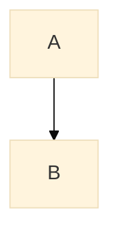

✅ **Use clean syntax with classDef:**
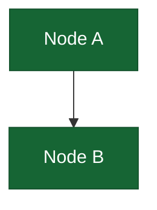

❌ **Don't overcomplicate:**


✅ **Split into logical sections:**
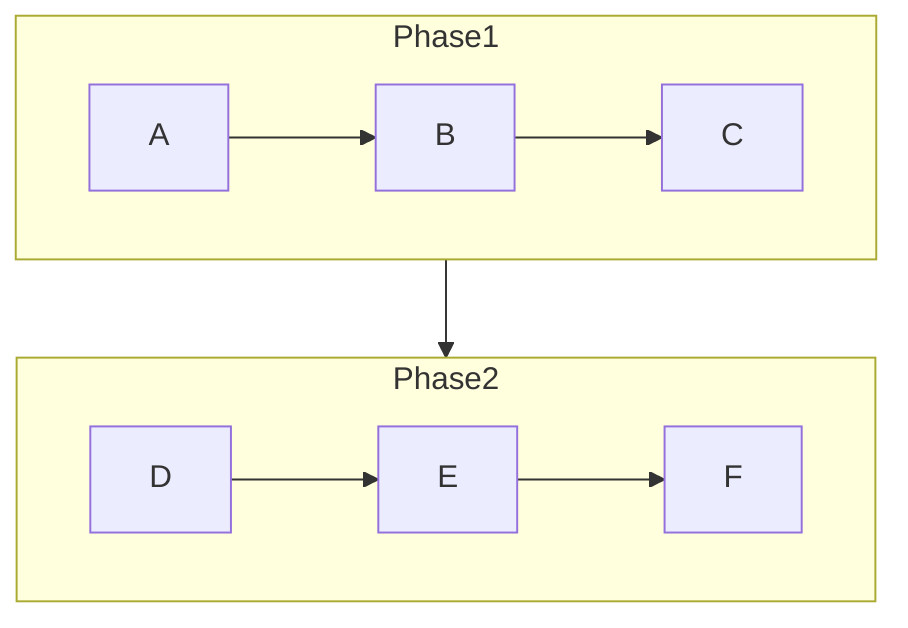

### Common Syntax Issues

| Issue | Problem | Fix |
|-------|---------|-----|
| Special characters in labels | Breaks parsing | Wrap in quotes: `node1["Label with : special"]` |
| Duplicate node IDs | Ambiguous references | Use unique IDs: `build1`, `build2` instead of `build`, `build` |
| Unclosed subgraphs | Invalid syntax | Add `end` for each `subgraph` declaration |
| Invalid arrow syntax | Won't render | Use `-->`, `-.->`, or `==>` not `->` or `~>` |
| Missing classDef | Styles don't apply | Define all classes before using `:::className` |
| Init directives | Breaks GitHub rendering | Remove completely - not needed for classDef |

**Example - Fixing Special Characters:**

❌ **WRONG:**
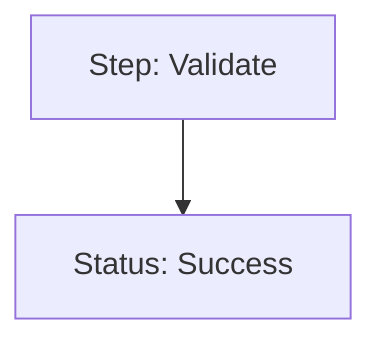

✅ **CORRECT:**


## Diagram Maintenance

### Update Triggers

Update diagrams when:
- Architecture changes
- New services added
- Workflows modified
- Infrastructure updates
- After major deployments

### Version Control

- Commit diagram changes with descriptive messages
- Reference related code PRs
- Keep old versions in git history
- Document diagram changes in commit messages

### Deprecation

When retiring diagrams:
1. Add deprecation notice above diagram
2. Point to replacement diagram
3. Keep for 1 release cycle
4. Remove in next major version

## Accessibility

### Text Descriptions

Always provide text description:

```markdown
The following diagram illustrates the ECS deployment workflow:

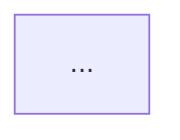

This workflow shows how GitHub Actions builds Docker images, pushes to ECR, and updates ECS task definitions.
```

### Alt Text

For critical diagrams, provide detailed alt text describing:
- Main components
- Key relationships
- Flow direction
- Decision points

## Tools and Resources

### Validation

- **mermaid-diagram-validator tool**: Validate syntax before committing
- **mermaid-diagram-preview tool**: Preview rendering in VS Code
- **Mermaid Live Editor**: Test complex diagrams at [mermaid.live](https://mermaid.live/)
- **GitHub PR Preview**: Verify rendering in pull request
- **mermaid-compliance skill**: Automated compliance checking

### Testing Workflow

1. **Write diagram** with proper syntax and classes
2. **Validate** using mermaid-diagram-validator tool
3. **Preview** using mermaid-diagram-preview tool
4. **Test complex diagrams** at [mermaid.live](https://mermaid.live/)
   - Paste diagram code
   - Verify colors and styling
   - Test edge cases (long labels, many nodes)
5. **Commit** only after all validation passes

### Documentation

- [Mermaid Official Docs](https://mermaid.js.org/)
- [Mermaid Live Editor](https://mermaid.live/) - Test rendering online
- Repository mermaid-compliance skill - Automated compliance
- [GitHub Mermaid Support](https://github.blog/2022-02-14-include-diagrams-markdown-files-mermaid/) - Official GitHub documentation

## Examples by Use Case

### Deployment Workflow

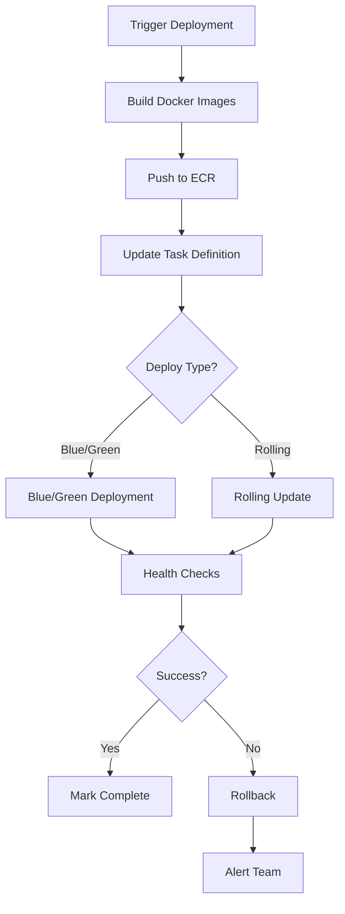

### AWS Architecture

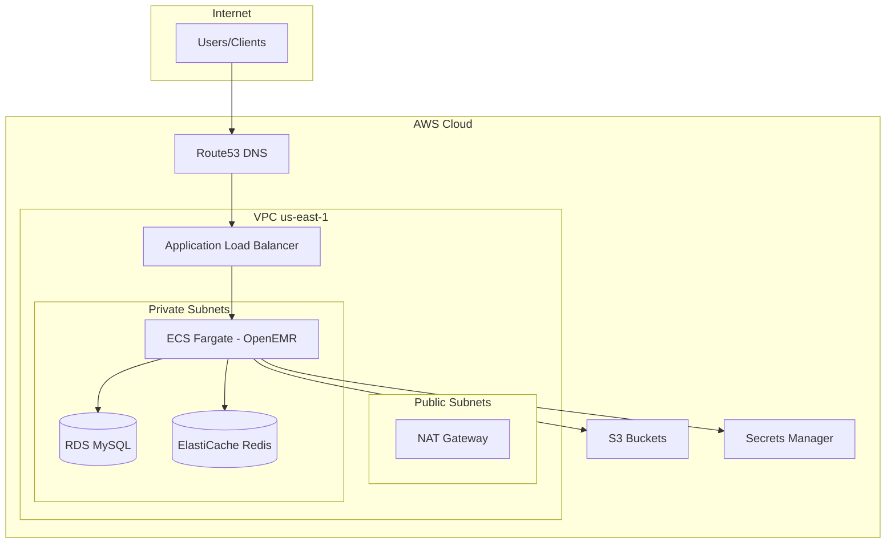

### Authentication Flow

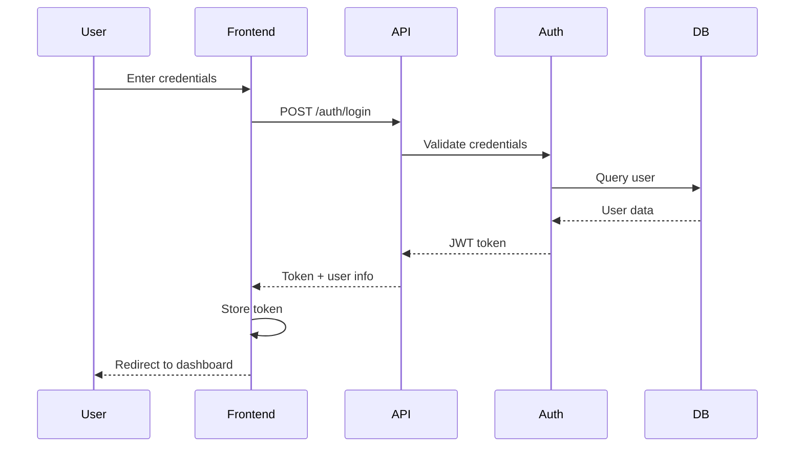
