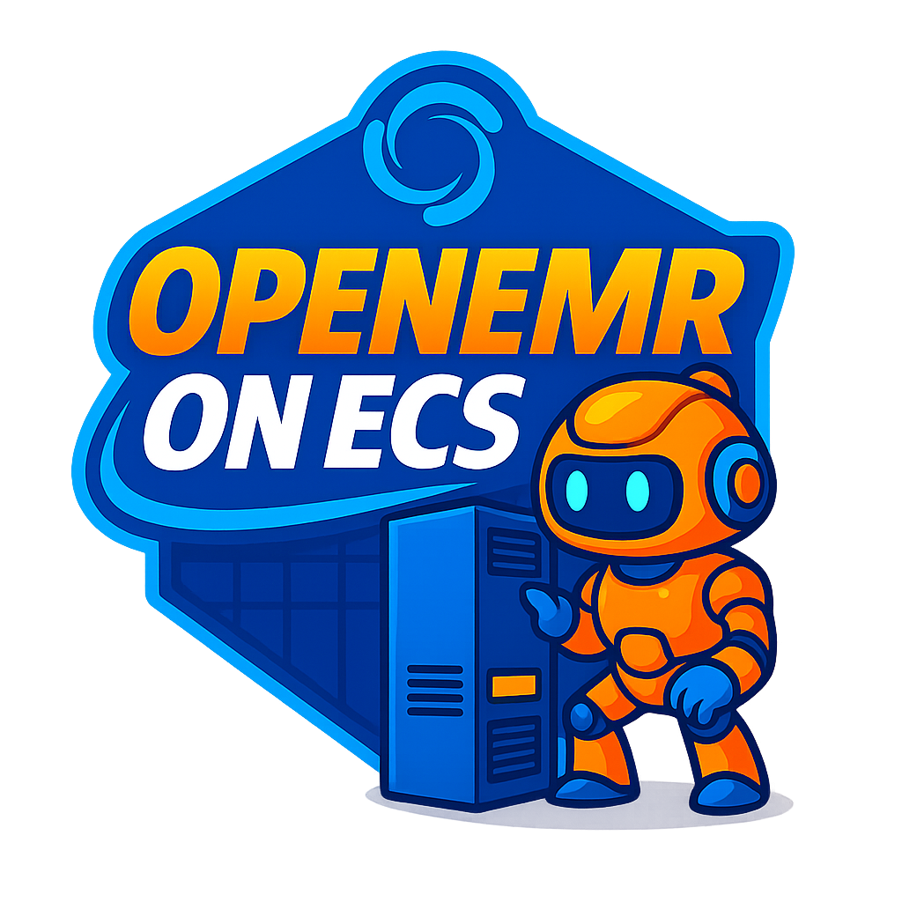

<div align="center">



[](https://github.com/openemr/openemr-on-ecs/actions/workflows/ci.yml)
[](LICENSE)
[](https://github.com/openemr/openemr-on-ecs/releases)

*This deployment provides a production-ready OpenEMR system on Amazon ECS with Fargate for serverless compute, automatic container orchestration, elastic scaling, and an integrated monitoring, security, and observability stack.*

</div>

> **⚠️ HIPAA Compliance Notice**: No matter what you're deploying to AWS full HIPAA compliance requires ...
>
> - Executed Business Associate Agreement (BAA) with AWS
> - Organizational policies and procedures
> - Staff training and access controls
> - Regular security audits and risk assessments

### Enterprise-Grade EHR System Starting at $320/month

---

## ⚡ Quick Start

> **New to Python or AWS?** Start with our [**Getting Started Guide for Beginners**](GETTING-STARTED.md) - it walks you through everything step-by-step!

```bash
# Install dependencies
pip install -r requirements.txt

# Configure settings in cdk.json (see Configuration section below)
# IMPORTANT: A certificate is required. Set either route53_domain or certificate_arn.

# Deploy (Duration: ~40 min)
cdk deploy
```

**What you get:**
- 🌐 OpenEMR URL (in terminal) and admin credentials (in secrets manager)
- 🚀 Entirely serverless deployment (no server management)
- 📈️ Configurable autoscaling (for any size deployment)


```bash
# When you're done
cdk destroy
```

---

## Table of Contents
- [Value Proposition](#value-proposition)
- [Architecture](#architecture)
  - [Component Relationships](#component-relationships)
  - [Architectural Elements](#architectural-elements)
- [What You Get](#what-you-get)
- [Costs](#costs)
- [Prerequisites](#prerequisites)
- [Quick Setup (~50 minutes)](#quick-setup-50-minutes)
- [Directory Overview](#directory-overview)
- [Access OpenEMR](#access-openemr)
- [Clean Up](#clean-up)
- [Need Help?](#need-help)
- [Automation & Maintenance](#automation--maintenance)
- [Additional Resources](#additional-resources)

## Value Proposition
Transform your healthcare facility with enterprise-grade EHR system at a fraction of traditional costs:

- **Traditional EHR setup**: $40-50M upfront
- **OpenEMR on AWS**: Starting at $320/month
- **Includes**: HIPAA-eligible architecture, automated scaling, multi-zone availability, and 7-year backup retention
- **Zero infrastructure management required**

## Architecture 


### Component Relationships
| Component | Purpose | Connects To | Scaling |
|-----------|---------|-------------|----------|
| Application Load Balancer | Traffic distribution & SSL termination | WAF, Fargate Tasks | Auto |
| AWS WAF | Web application firewall | Internet, ALB | Fixed |
| ECS Fargate | OpenEMR application hosting | ALB, EFS, RDS, ElastiCache | Auto |
| Amazon EFS | Shared file storage | Fargate Tasks | Auto |
| Aurora Serverless v2 | MySQL database | Fargate Tasks | Auto |
| ElastiCache Serverless | Redis caching | Fargate Tasks | Auto |
| Secrets Manager | Credential storage | Fargate Tasks | Managed |
| KMS | Encryption key management | All encrypted services | Managed |

### Architectural Elements

**Compute Layer**
- **ECS Fargate**: Serverless container platform running OpenEMR with automatic scaling based on CPU/memory utilization

**Storage Layer**
- **Amazon EFS**: Serverless NFS for shared OpenEMR files, documents, and configurations
- **Aurora Serverless v2**: Auto-scaling MySQL database with multi-AZ deployment for high availability

**Caching Layer**
- **ElastiCache Serverless**: Redis cache for session management and application performance optimization

**Security Layer**
- **AWS WAF**: Protection against common web exploits and bot attacks
- **KMS**: Encryption at rest for all data stores
- **Secrets Manager**: Secure credential rotation and access

**Network Layer**
- **Application Load Balancer**: SSL termination and traffic distribution across availability zones
- **Private Subnets**: Isolated network segments for database and cache resources
- **NAT Gateways**: Secure outbound internet access for private resources 

## What You Get
- A fully managed, HIPAA-eligible OpenEMR installation
- Automatic scaling to handle any workload
- Enterprise security with AWS WAF and encrypted storage
- Automated daily, weekly, and monthly backups with 7-year retention
- High availability across multiple AWS availability zones

## Costs
You'll pay for the AWS resources you use with this architecture but since that will depend on your level of usage we'll compute an estimate of the base cost of this architecture (this will vary from region to region).

Key Assumptions:
- Work week: 40 hours (8 hours/day, 5 days/week)
- Peak hours: 8AM-4PM EST, Monday-Friday (160 hours/month)
- Off-peak hours: All other times (570 hours/month)
- Region: Oregon (us-west-2)
- Load Balancer: 25 requests per second

### Calculation
- AWS Fargate: **Note: A minimum of two tasks with 2 vCPU and 4GB of memory running during peak and off-peak hours for this architecture**
  - Peak Hours (160 hours):
    - vCPU: 2 tasks × 2 vCPU × 160 hours × $0.04048 = $25.91
    - Memory: 2 tasks × 4 GB × 160 hours × $0.004445 = $5.69
  - Off-Peak Hours (570 hours):
    - vCPU: 2 tasks × 2 vCPU × 570 hours × $0.04048 = $92.29
    - Memory: 2 tasks × 4 GB × 570 hours × $0.004445 = $20.27
  - Total: $118.20 + $25.96 = **$144.16/month**
- Load Balancer: 25 requests per second
  - $0.0225/hour = 730h * $0.0225 = $16.43/month
  - LCU cost: 1 LCU × $0.008 × 730 hours = $5.84/month
  - Total: $16.43 (Fixed) + $5.84 (LCU) = **$22.27/month**
- 2 NAT Gateways: $0.09/hour = 2 * (730h * $0.045) = **$65.70/month**
- Elasticache Serverless: $0.0084/hour = 730h * $0.0088 = **$6.45/month**
- EFS Costs: Minimum billing is 1GB per mount (2 mounts)
  - Total: 2GB × $0.08 per GB-month = **$0.16/month**
- RDS Aurora Serverless V2: 
  - **Base (always-on)**: 730 hours × 0.5 ACU × $0.12 = $43.80/month - Minimum capacity (ensures instant connections)
  - **Peak scaling**: 160 hours × 1.5 ACU × $0.12 = $28.80/month - Additional capacity during peak hours (scales from 0.5 to 2 ACU)
  - **Storage**: 10GB × $0.10 per GB = $1.00/month
  - **Baseline IO**: (730 hours × 3,600) × $0.0000002 = $0.53/month
  - Total: $43.80 + $28.80 + $1.00 + $0.53 = **$74.13/month**
  - *Note: min_capacity=0.5 ACU ensures the database is always available with instant connections (no 3-5 minute cold starts)*
- AWS Backup Costs:
  - Backup Storage Calculation: Daily backups (30 days): 0.005 GB × 30 = 0.15 GB Weekly backups (52 weeks): 0.005 GB × 52 = 0.26 GB Monthly backups (84 months/7 years): 0.005 GB × 84 = 0.42 GB Total backup storage: 0.83 GB
  - Warm storage (first 50TB): $0.05 per GB-month
    - Cost per month: 0.83 GB × $0.05 = $0.0415/month
  - Additional costs:
    - Backup API requests: $0.05 per 1,000 requests
    - 30 daily + 4 weekly + 1 monthly = ~35 backups per month
    - Cost: (35/1000) × $0.05 = $0.00175/month
  - Total AWS Backup Monthly Cost: **$0.05/month**
- 2 Secrets Manager Secrets: **$0.80/month**
- 1 WAF ACL with enhanced protection rules: **$5/month base + additional costs for managed rule groups**
  - Includes: AWS Managed Common Rule Set, SQL Injection Protection, Known Bad Inputs, Rate Limiting (2000 req/5min/IP), and Suspicious User-Agent blocking
- 1 KMS Key: **$1/month**
- **Total base cost: ~$320/month**

This works out to a base cost of $320/month. The true value of this architecture is its ability to rapidly autoscale and support even very large organizations. For smaller organizations you may want to consider looking at some of [OpenEMR's offerings in the AWS Marketplace](https://aws.amazon.com/marketplace/seller-profile?id=bec33905-edcb-4c30-b3ae-e2960a9a5ef4) which are more affordable.

**Note on Aurora Serverless v2 Pricing:** The database is configured with `min_capacity=0.5` ACU to ensure instant connections with no cold start delays. This adds ~$34/month to the base cost compared to scaling to zero, but provides 100% availability and eliminates 3-5 minute connection delays.

## Prerequisites

Before starting, you'll need:

1. **An AWS Account** - Sign up at https://aws.amazon.com/ (credit card required, but won't be charged until you use resources)
2. **AWS CLI** - Install from https://aws.amazon.com/cli/ (then run `aws configure` with your AWS credentials)
3. **Python 3.14** - Install from https://www.python.org/downloads/ (check "Add to PATH" during installation)
4. **Node.js** - Install from https://nodejs.org/ (download the LTS version)
5. **AWS CDK** - Install via `npm install -g aws-cdk` (requires Node.js)

> **Not sure how to install these?** See our [**Getting Started Guide**](GETTING-STARTED.md) which includes step-by-step installation instructions for each tool.

*For advanced setup options, see [DETAILS.md Instructions section](./DETAILS.md#instructions)*

## Quick Setup (~50 minutes)

> **First time deploying?** See [**GETTING-STARTED.md**](GETTING-STARTED.md) for detailed beginner-friendly instructions.

1. **Install Dependencies**
   ```bash
   # Create a Python virtual environment (isolates this project's dependencies)
   python3 -m venv .venv
   
   # Activate the virtual environment
   # On Mac/Linux:
   source .venv/bin/activate
   # On Windows:
   .venv\Scripts\activate
   
   # Install required Python packages
   pip install -r requirements.txt
   ```
   
   **What is a virtual environment?** It's like a separate workspace for this project that keeps its dependencies isolated from other projects. You'll need to activate it (`source .venv/bin/activate`) each time you open a new terminal.

2. **Configure Access and Certificate**
   - Open `cdk.json` in a text editor
   - **Certificate (Required):** A certificate is required for HTTPS. Either:
     - Set `route53_domain` to your domain (e.g., `"example.com"`) for automated certificate management (recommended), or
     - Set `certificate_arn` to an existing ACM certificate ARN
   - **IP Access:** Find `security_group_ip_range_ipv4`
     - **For testing:** Leave as `"auto"` (automatically allows your current IP) or `"0.0.0.0/0"` (allows access from anywhere - not secure but convenient)
     - **For better security:** Change to your IP address, e.g., `"203.0.113.131/32"` (replace with your actual IP - find it at https://whatismyipaddress.com/)
   
   **Understanding the format:** `203.0.113.131/32` means "only allow this specific IP address". `0.0.0.0/0` means "allow any IP address". `"auto"` automatically detects and allows your current public IP.
   
   *For advanced configuration options, see [DETAILS.md Customizing Architecture Attributes](./DETAILS.md#customizing-architecture-attributes) and [HTTPS Setup Guide](./DETAILS.md#enabling-https-for-client-to-load-balancer-communication)*

3. **Validate Setup (Recommended)**
   ```bash
   # Check that everything is configured correctly
   ./scripts/validate-deployment-prerequisites.sh
   ```
   This verifies your AWS credentials, CDK setup, and configuration before deploying.

4. **Bootstrap CDK (First Time Only)**
   ```bash
   # One-time setup - tells AWS about CDK
   cdk bootstrap
   ```

5. **Deploy (~40 minutes)** 
   ```bash
   # Deploy OpenEMR to AWS
   cdk deploy
   ```
   
   CDK will show what it's creating and ask for confirmation. Type `y` to proceed. The deployment takes about 40 minutes - AWS is creating databases, networking, and other resources.
   
## Directory Overview

```
.
├── app.py                                          # CDK app entrypoint
├── cdk.json                                        # CDK context (tunable defaults)
├── requirements.txt                                # Python dependencies
├── openemr_ecs/                                    # CDK stacks and modules
│   ├── stack.py                                    # Orchestrator
│   ├── compute.py                                  # ECS/Fargate service
│   ├── network.py                                  # VPC, ALB, SGs
│   ├── storage.py                                  # EFS, Backup
│   ├── database.py                                 # Aurora config
│   ├── security.py                                 # WAF, certs, DNS, SES
│   ├── analytics.py                                # Optional analytics env
│   ├── monitoring.py                               # CloudWatch alarms and SNS
│   ├── validation.py                               # Configuration validation
│   ├── utils.py                                    # Shared utilities
│   └── constants.py                                # Shared constants/versions
├── lambda/                                         # Lambda functions
│   └── lambda_functions.py                         # Lambda code for triggers
├── compose/                                        # Local docker-compose test rigs (basic & SSL)
│   ├── docker-compose.test.yml                     # Basic test configuration
│   └── docker-compose.test-ssl.yml                 # SSL test configuration
├── scripts/                                        # Helper scripts for deployment, testing, and validation
│   ├── validate-deployment-prerequisites.sh        # Pre-deployment validation
│   ├── stress-test.sh                              # CDK stack stress testing
│   ├── load-test.sh                                # Load testing for deployed application
│   ├── restore-from-backup.sh                      # Restore from AWS Backup recovery points
│   ├── test-startup.sh                             # Local container testing (basic)
│   ├── test-startup-ssl.sh                         # Local container testing (with SSL)
│   └── README.md                                   # Scripts documentation
├── tests/                                          # Unit tests for CDK stack
├── docs/                                           # Images and diagrams
├── README.md                                       # This file
├── GETTING-STARTED.md                              # Beginner-friendly setup guide
├── README-TESTING.md                               # Local testing guide
├── DEPLOYMENT-RELIABILITY.md                       # Deployment reliability improvements
├── BACKUP-RESTORE-GUIDE.md                         # Backup and restore procedures
├── DETAILS.md                                      # Deep configuration details
├── ARCHITECTURE.md                                 # Architecture deep dive
├── TROUBLESHOOTING.md                              # Common issues/solutions
├── LICENSE                                         # Project license
└── CHANGELOG.md                                    # Version history
```

## Access OpenEMR
1. Use the URL provided in the deployment output
2. Login credentials:
   - Username: `admin`
   - Password: Find in AWS Secrets Manager under "Password..."

## Clean Up
When you have completed your testing you can clean up the deployed environment by running:
```bash
   cdk destroy
```
Manual cleanup items:
- AWS Backup Vault

*For information about backup retention and recovery, see [DETAILS.md AWS Backup section](DETAILS.md#how-aws-backup-is-used-in-this-architecture)*

## Helper Scripts

This project includes several helper scripts in the `scripts/` directory:

### Pre-Deployment Validation

**`scripts/validate-deployment-prerequisites.sh`** - Validates your setup before deploying:
- Checks AWS CLI installation and credentials
- Verifies CDK installation and bootstrap status
- Validates Python dependencies
- Checks for existing stack status
- Validates CDK stack synthesis
- Checks Route53 hosted zone (if configured)

**Usage:**
```bash
# Can be run from project root or any subdirectory
./scripts/validate-deployment-prerequisites.sh
# or from scripts directory:
cd scripts && ./validate-deployment-prerequisites.sh
```

This script automatically detects the project root by searching for `cdk.json`, so it works from any subdirectory.

### CDK Stack Stress Testing

**`scripts/stress-test.sh`** - Tests CDK stack synthesis and optionally deployment/destruction with various configurations.

**Synthesis Testing (Default):**
```bash
./scripts/stress-test.sh
```
Tests stack synthesis with minimal, standard, and full-featured configurations without actually deploying.

**Full Deployment Testing:**
```bash
export DEPLOY_ACTUAL=true
./scripts/stress-test.sh
```
⚠️ **Warning:** This will actually deploy and destroy stacks, which takes ~40 minutes per configuration. Only use this if you want to stress test actual deployments.

### Load Testing

**`scripts/load-test.sh`** - Load tests the deployed OpenEMR application to verify performance under load.

**Basic Usage:**
```bash
# Load test with default settings (60s, 50 concurrent users, 100 RPS)
./scripts/load-test.sh OpenemrEcsStack

# Custom load test
export DURATION=120
export CONCURRENT_USERS=100
export REQUESTS_PER_SECOND=200
./scripts/load-test.sh OpenemrEcsStack
```

This script automatically:
- Retrieves the application URL from CloudFormation outputs
- Waits for the application to be ready
- Runs concurrent load tests and measures performance
- Reports success rate, response times (avg, median, P95, P99), and RPS

**Requirements:** Python 3 with `requests` library, AWS CLI configured, and a deployed stack.

See [scripts/README.md](scripts/README.md) for detailed usage and configuration options.

### Configuration Matrix Testing

Test all configuration combinations to ensure features work correctly:

**Python Test Script (Recommended):**
```bash
# Test all 8 configurations (minimal, standard, full-featured, with/without monitoring, etc.)
python3 scripts/test-cdk-synthesis.py

# Verbose output with detailed errors
python3 scripts/test-cdk-synthesis.py --verbose

# Stop on first failure
python3 scripts/test-cdk-synthesis.py --fail-fast
```

**Bash Stress Test:**
```bash
# Test 6 core configurations (synthesis only - fast)
./scripts/stress-test.sh

# Test actual deployment and destruction (slow - ~40 min per config)
export DEPLOY_ACTUAL=true
./scripts/stress-test.sh
```

**What's tested:**
- Minimal configuration (core features only)
- Standard configuration (Bedrock + Data API)
- Full-featured (Global Accelerator + Analytics)
- Monitoring alarms (SNS + CloudWatch)
- API and patient portal features
- CloudTrail logging

### Local Testing Scripts

- **`scripts/test-startup.sh`** - Test container startup locally without SSL
- **`scripts/test-startup-ssl.sh`** - Test container startup locally with SSL certificates

See [README-TESTING.md](README-TESTING.md) for detailed usage.

## Need Help?

- **📚 New to this?** Start with [**GETTING-STARTED.md**](GETTING-STARTED.md) - a beginner-friendly step-by-step guide
- **🔧 Troubleshooting?** See [TROUBLESHOOTING.md](TROUBLESHOOTING.md) for common issues and solutions
- **⚙️ Advanced configuration?** Check [DETAILS.md](DETAILS.md) for all configuration options
- **🧪 Testing locally?** See [README-TESTING.md](README-TESTING.md) to test before deploying
- **🐛 Found a bug?** Submit issues on GitHub: https://github.com/openemr/host-openemr-on-aws-fargate
- **💬 Have questions?** Join the OpenEMR community: https://community.open-emr.org/

## Automation & Maintenance

### CI/CD Workflows

The project includes comprehensive CI/CD automation:

- **CI Validation (`.github/workflows/ci.yml`)** 
  - Runs on every PR and push to `main`/`develop`
  - Unit tests with pytest
  - **Configuration matrix testing** - Tests 8 configuration combinations
  - CDK synthesis validation with cdk_nag checks
  - CloudFormation template validation with cfn-lint
  - Code quality checks (black, flake8, mypy, isort)
  - Security scanning with bandit
  - Shell script validation with shellcheck
  - Docker Compose tests (basic and SSL configurations)
  - Go TUI build and tests

- **Configuration Matrix Testing (`.github/workflows/cdk-config-matrix.yml`)**
  - Dedicated workflow for comprehensive configuration testing
  - Tests all feature combinations (monitoring, analytics, APIs, etc.)
  - Automatically runs on every commit
  - Can be triggered manually via `workflow_dispatch`
  - Uploads synthesis logs on failure for debugging

- **Monthly Version Check (`.github/workflows/monthly-version-check.yml`)** 
  - Scheduled on the first of each month (and manually runnable)
  - Scans pinned Python packages, Aurora engine versions, EMR Serverless releases, Lambda runtimes, and container tags
  - Creates an issue when updates are detected

- **Manual Release (`.github/workflows/manual-release.yml`)** 
  - Guided `workflow_dispatch` release process
  - Semantic version bumps
  - Tag/release creation with optional dry run

All workflows use mocked AWS credentials with `cdk synth --no-lookups` to keep the pipeline credential-free.

**Testing Tools:**
- `scripts/test-cdk-synthesis.py` - Python-based comprehensive configuration testing
- `scripts/stress-test.sh` - Bash-based stress testing with optional deployment
- `scripts/validate-deployment-prerequisites.sh` - Pre-flight validation

## Additional Resources

### Core Documentation
- [Architecture Documentation](ARCHITECTURE.md) - Detailed architecture overview, component relationships, network design, security architecture, and design decisions
- [Troubleshooting Guide](TROUBLESHOOTING.md) - Common issues and solutions including database connection problems, container health checks, SSL/TLS issues, and deployment failures
- [Detailed Configuration Guide](DETAILS.md) - Complete configuration options and advanced features for customizing your deployment
- [Local Testing Guide](README-TESTING.md) - Test the container startup locally using Docker Compose before deploying to AWS

### Helper Scripts & Tools
- [Scripts Documentation](scripts/README.md) - Complete guide to all helper scripts including validation, stress testing, configuration testing, local testing, and database access tools

### Configuration & Customization
- [Load Testing Results](DETAILS.md#load-testing) - Performance testing results showing the architecture's ability to handle 4000+ requests/second with low resource utilization
- [Customizing Architecture Attributes](DETAILS.md#customizing-architecture-attributes) - Guide to configuring autoscaling, security groups, SSL certificates, and other architecture parameters via `cdk.json`
- [Serverless Analytics Environment](DETAILS.md#serverless-analytics-environment) - Setup guide for the optional SageMaker Studio environment with EMR Serverless for machine learning and data analytics

### Security & Compliance
- [HTTPS Setup Guide](DETAILS.md#enabling-https-for-client-to-load-balancer-communication) - Certificate requirements and configuration options for HTTPS (certificate is required for deployment - either `route53_domain` for automated management or `certificate_arn` for existing certificates)
- [DNS Automation](DETAILS.md#automating-dns-setup) - Automated DNS management with Route53, SSL certificate generation, and SES email configuration
- [Security Best Practices](DETAILS.md#regarding-security) - Security recommendations including cdk_nag checks, container vulnerability scanning, and IAM best practices
- [HIPAA Compliance Notes](DETAILS.md#notes-on-hipaa-compliance-in-general) - Important information about HIPAA compliance requirements, BAA signing, and compliance considerations

### Advanced Features
- [REST and FHIR APIs](DETAILS.md#rest-and-fhir-apis) - Step-by-step guide to enabling and using OpenEMR's REST and FHIR APIs for integration
- [AWS Backup Configuration](DETAILS.md#how-aws-backup-is-used-in-this-architecture) - Automated backup strategy with daily, weekly, and monthly backups with 7-year retention
- [Backup and Restore Guide](BACKUP-RESTORE-GUIDE.md) - Comprehensive guide for restoring from AWS Backup recovery points
- [Database Access via ECS Exec](DETAILS.md#using-ecs-exec) - Secure database access using ECS Exec and port forwarding for remote database management
- [Aurora ML for AWS Bedrock](DETAILS.md#aurora-ml-for-aws-bedrock) - Integration guide for using AWS Bedrock foundation models directly from MySQL queries
- [AWS Global Accelerator](DETAILS.md#using-aws-global-accelerator) - Performance optimization for global deployments using AWS Global Accelerator

### External Resources
- [AWS CDK Documentation](https://docs.aws.amazon.com/cdk/) - Official AWS CDK documentation and API reference
- [AWS CLI Documentation](https://docs.aws.amazon.com/cli/) - AWS CLI command reference and usage guides
