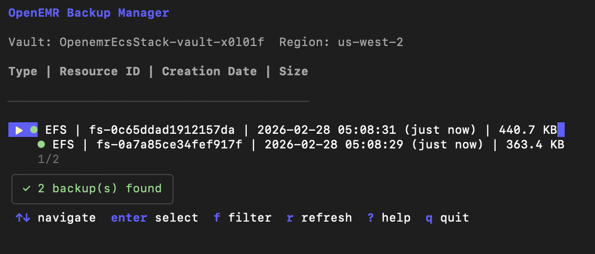
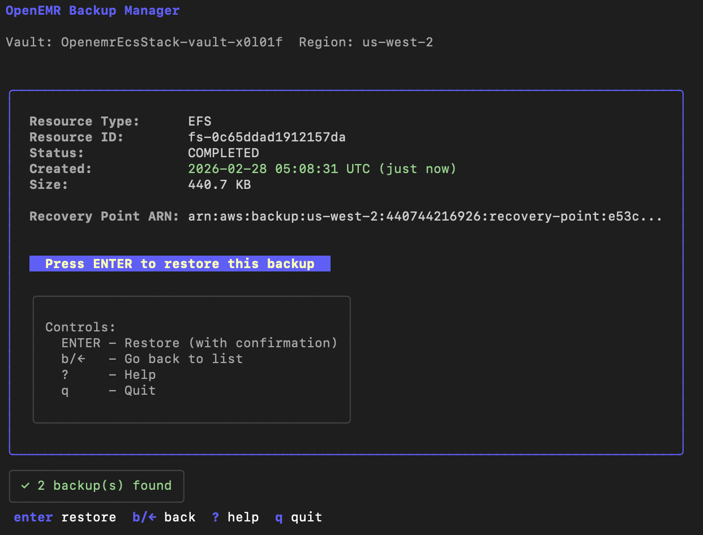

# OpenEMR Backup Manager TUI

A beautiful Terminal User Interface (TUI) built with Go, Bubbletea, and Lipgloss for managing and restoring AWS backups interactively.

## Table of Contents

- [Features](#features)
- [Screenshots](#screenshots)
  - [Backup List View](#backup-list-view)
  - [Backup Detail View](#backup-detail-view)
- [Installation](#installation)
  - [Prerequisites](#prerequisites)
  - [Build](#build)
- [Usage](#usage)
  - [Basic Usage](#basic-usage)
  - [Command Line Options](#command-line-options)
  - [Controls](#controls)
- [Features in Detail](#features-in-detail)
  - [Backup List View](#backup-list-view-1)
  - [Backup Detail View](#backup-detail-view-1)
  - [Help Screen](#help-screen)
- [Development](#development)
  - [Project Structure](#project-structure)
  - [Dependencies](#dependencies)
  - [Building for Distribution](#building-for-distribution)
- [Comparison with Bash Script](#comparison-with-bash-script)
- [Future Enhancements](#future-enhancements)
- [Contributing](#contributing)
- [License](#license)
- [See Also](#see-also)

## Features

- 🎨 **Beautiful UI** - Modern, colorful interface with smooth navigation
- 📋 **Browse Backups** - List all recovery points with details (type, date, size)
- 🔍 **Filter by Type** - Filter backups by resource type (RDS/EFS)
- 📊 **View Details** - See comprehensive backup information
- 🔄 **Initiate Restores** - Start restore operations with a single keypress
- ⚡ **Fast & Responsive** - Built with Go for excellent performance
- 🔐 **AWS Integration** - Seamlessly integrates with AWS Backup service

## Screenshots

### Backup List View



### Backup Detail View



## Installation

### Prerequisites

- Go 1.21 or later
- AWS credentials configured (via `aws configure` or environment variables)
- Deployed OpenEMR stack with AWS Backup configured

### Build

```bash
cd scripts/backup-tui
go mod download
go build -o backup-tui .
```

Or install globally:

```bash
go install .
```

## Usage

### Basic Usage

```bash
# Launch with default settings (uses OpenemrEcsStack in us-west-2)
./backup-tui

# Specify stack name and region
./backup-tui -stack MyStackName -region us-east-1

# Filter by resource type
./backup-tui -type RDS
./backup-tui -type EFS

# Use specific backup vault
./backup-tui -vault MyBackupVault
```

### Command Line Options

```
-stack string     CloudFormation stack name (default: "OpenemrEcsStack")
-vault string     Backup vault name (auto-discovered if not provided)
-region string    AWS region (default: "us-west-2")
-type string      Resource type to filter (RDS or EFS, empty for all)
-help             Show help message
```

### Controls

| Key | Action |
|-----|--------|
| `↑` / `↓` or `k` / `j` | Navigate backup list |
| `Enter` | Select backup / Confirm action |
| `b` / `←` | Go back |
| `r` | Refresh backup list |
| `?` | Show/hide help |
| `q` / `Esc` | Quit application |

## Features in Detail

### Backup List View

- Shows all available backups in the backup vault
- Displays resource type, resource ID, creation date, and size
- Highlights selected backup
- Auto-discovers backup vault from stack name

### Backup Detail View

- Shows comprehensive backup information:
  - Recovery Point ARN
  - Resource Type and ID
  - Creation Date and Time
  - Backup Size
  - Status
- One-click restore initiation
- Easy navigation back to list

### Help Screen

- Quick reference for all keyboard shortcuts
- Tips and usage examples
- Accessible from any screen with `?`

## Development

### Project Structure

```
backup-tui/
├── main.go                    # Entry point
├── go.mod                     # Go module dependencies
├── Makefile                   # Build automation
├── backup-tui.sh              # POSIX-compliant launcher script
├── internal/
│   ├── app/
│   │   └── model.go           # Main application model (Bubbletea)
│   ├── aws/
│   │   ├── backup.go          # AWS Backup client
│   │   └── config.go          # AWS config loading
│   └── ui/
│       ├── list.go            # List view component
│       ├── detail.go          # Detail view component
│       ├── help.go            # Help screen component
│       └── logo.go            # OpenEMR logo (ASCII art)
└── README.md
```

### Dependencies

- **Bubbletea** - TUI framework for Go
- **Lipgloss** - Style definitions for terminal UIs
- **AWS SDK v2** - AWS service clients

### Building for Distribution

```bash
# Build for current platform
go build -o backup-tui .

# Build for Linux
GOOS=linux GOARCH=amd64 go build -o backup-tui-linux-amd64 .

# Build for macOS
GOOS=darwin GOARCH=amd64 go build -o backup-tui-darwin-amd64 .

# Build for Windows
GOOS=windows GOARCH=amd64 go build -o backup-tui-windows-amd64.exe .
```

## Comparison with Bash Script

| Feature | Bash Script | TUI (Go) |
|---------|-------------|----------|
| User Experience | Command-line prompts | Interactive visual interface |
| Navigation | Sequential prompts | Keyboard navigation |
| Visual Feedback | Text-based | Colored, styled output |
| Performance | Good | Excellent (compiled) |
| Installation | No installation needed | Requires Go build |
| Portability | Works everywhere | Single binary (after build) |

## Future Enhancements

- [ ] Search/filter functionality
- [ ] Real-time restore progress monitoring
- [ ] Multi-selection for batch operations
- [ ] Export backup list to CSV/JSON
- [ ] Compare backups
- [ ] Backup scheduling information
- [ ] Color themes/customization

## Contributing

Contributions are welcome! Please feel free to submit issues or pull requests.

## License

Same license as the main OpenEMR on ECS project.

## See Also

- [Bubbletea Documentation](https://github.com/charmbracelet/bubbletea)
- [Lipgloss Documentation](https://github.com/charmbracelet/lipgloss)
- [AWS Backup Documentation](https://docs.aws.amazon.com/aws-backup/)
- Bash script alternative: `scripts/restore-from-backup.sh`

