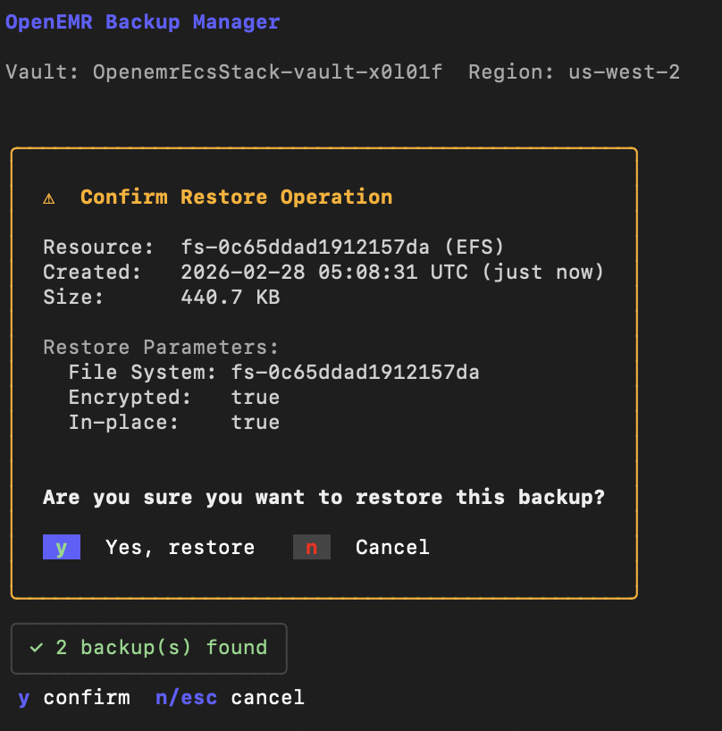
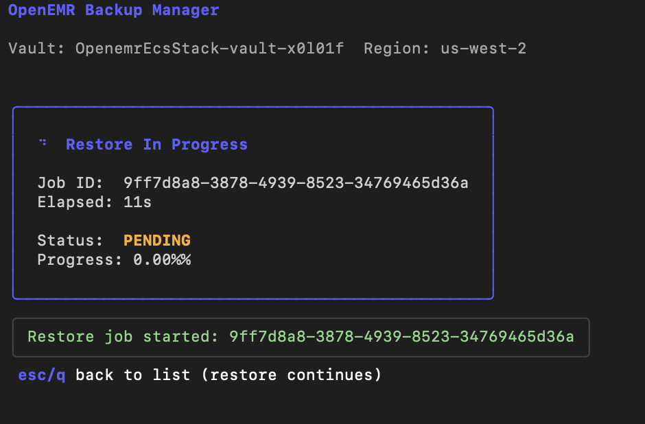

# OpenEMR Backup Manager TUI

A beautiful Terminal User Interface (TUI) built with Go, Bubbletea v2, and Lipgloss v2 for managing and restoring AWS backups interactively.

## Table of Contents

- [Features](#features)
- [Screenshots](#screenshots)
- [Installation](#installation)
  - [Prerequisites](#prerequisites)
  - [Build](#build)
- [Usage](#usage)
  - [Basic Usage](#basic-usage)
  - [Command Line Options](#command-line-options)
  - [Controls](#controls)
- [Features in Detail](#features-in-detail)
  - [Backup List View](#backup-list-view)
  - [Backup Detail View](#backup-detail-view)
  - [Restore Confirmation](#restore-confirmation)
  - [Live Restore Monitoring](#live-restore-monitoring)
  - [In-App Filtering](#in-app-filtering)
  - [Backup Freshness Coloring](#backup-freshness-coloring)
  - [Help Screen](#help-screen)
- [Development](#development)
  - [Project Structure](#project-structure)
  - [Running Tests](#running-tests)
  - [Dependencies](#dependencies)
  - [Building for Distribution](#building-for-distribution)
- [Comparison with Bash Script](#comparison-with-bash-script)
- [Future Enhancements](#future-enhancements)
- [Contributing](#contributing)
- [License](#license)
- [See Also](#see-also)

## Features

- 🎨 **Beautiful UI** - Modern, colorful interface with smooth navigation
- 📋 **Browse Backups** - List all recovery points with details (type, date, size)
- 🔍 **In-App Filtering** - Cycle through All / RDS / EFS with a single keypress (`f`)
- 📊 **View Details** - See comprehensive backup information with relative timestamps
- 🔄 **Initiate Restores** - Start restore operations with confirmation and metadata preview
- 📡 **Live Restore Monitoring** - Track restore job progress in real-time with status polling
- 🟢 **Freshness Coloring** - Color-coded backup age indicators (green/yellow/red)
- 🔎 **Auto-Discovery** - Automatically discovers stack name and backup vault
- ⚡ **Fast & Responsive** - Built with Go for excellent performance
- 🔐 **AWS Integration** - Seamlessly integrates with AWS Backup service

## Screenshots

### Backup List View

Browse all recovery points with type, resource ID, creation date (with relative time), and size. Backups are color-coded by freshness.


### Backup Detail View

View comprehensive details for a selected backup including resource type, status, creation timestamp, size, and recovery point ARN. Press Enter to initiate a restore.


### Restore Confirmation with Metadata Preview

Before restoring, review the restore parameters (cluster ID, subnet group, security groups for RDS; file system ID, encryption, and in-place mode for EFS). Press `y` to confirm or `n` to cancel.



### Live Restore Monitoring

After confirming a restore, the TUI polls AWS Backup every 5 seconds and displays live job status, elapsed time, and percent completion. Press Esc to return to the list while the restore continues in the background.



## Installation

### Prerequisites

- Go 1.25 or later
- AWS credentials configured (via `aws configure`, environment variables, or AWS profile)
- Deployed OpenEMR stack with AWS Backup configured

### Build

```bash
cd scripts/backup-tui
go mod download
go build -o backup-tui .
```

Or install globally:

```bash
go install .
```

## Usage

### Basic Usage

```bash
# Launch with auto-discovery (recommended, discovers stack name automatically)
./backup-tui

# Use a specific AWS profile
AWS_PROFILE=my-profile ./backup-tui

# Specify stack name and region
./backup-tui -stack MyStackName -region us-east-1

# Filter by resource type at launch
./backup-tui -type RDS
./backup-tui -type EFS

# Use specific backup vault
./backup-tui -vault MyBackupVault
```

### Command Line Options

```
-stack string     CloudFormation stack name (auto-discovered if not provided)
-vault string     Backup vault name (auto-discovered if not provided)
-region string    AWS region (default: "us-west-2")
-type string      Resource type to filter (RDS or EFS, empty for all)
-help             Show help message
```

### Controls

| Key | Action |
|-----|--------|
| `↑` / `↓` or `k` / `j` | Navigate backup list |
| `PgUp` / `PgDn` | Page up / page down |
| `g` / `G` | Jump to first / last backup |
| `Enter` | Select backup / Initiate restore |
| `f` | Cycle filter: All → RDS → EFS |
| `r` | Refresh backup list |
| `b` / `←` / `Backspace` | Go back |
| `?` | Show/hide help |
| `y` / `n` | Confirm / cancel restore |
| `Esc` / `q` | Back / Quit |

## Features in Detail

### Backup List View

- Shows all available backups in the backup vault
- Displays resource type, resource ID, creation date (with relative time like "2h ago"), and size
- Color-coded freshness dots: 🟢 green (<24h), 🟡 yellow (1-7d), 🔴 red (>7d)
- Highlights selected backup with cursor indicator
- Shows scroll indicators when the list exceeds the viewport
- Position indicator (e.g., "3/12") at the bottom
- Status bar shows backup count and active filter

### Backup Detail View

- Shows comprehensive backup information:
  - Resource Type and ID
  - Status (COMPLETED, AVAILABLE, etc.)
  - Creation Date with relative time and freshness-colored text
  - Backup Size (human-readable)
  - Recovery Point ARN (truncated for display)
- One-keypress restore initiation
- Controls reference at the bottom

### Restore Confirmation

- Displays a warning-styled confirmation dialog before restoring
- Shows restore parameters fetched from the live AWS environment:
  - **RDS**: Cluster ID, subnet group, security groups
  - **EFS**: File system ID, encryption status, in-place flag
- Clear `y` / `n` prompt with styled buttons

### Live Restore Monitoring

- After confirming a restore, transitions to a live monitoring view
- Polls AWS Backup `DescribeRestoreJob` every 5 seconds
- Displays:
  - Job ID
  - Elapsed time
  - Current status (PENDING, RUNNING, COMPLETED, FAILED, ABORTED)
  - Percent completion
  - Status message and duration (when terminal)
- Status is color-coded: yellow for in-progress, green for completed, red for failed/aborted
- Press Esc to return to the list — the restore continues running on AWS

### In-App Filtering

- Press `f` to cycle through resource type filters: All → RDS → EFS → All
- Active filter is shown as a badge in the header
- Status bar shows filtered count (e.g., "1 of 3 backup(s) shown (RDS)")
- Combine with `-type` CLI flag for pre-filtered launch

### Backup Freshness Coloring

Backups are visually tagged by age to help prioritize restore decisions:

| Age | Color | Meaning |
|-----|-------|---------|
| < 24 hours | 🟢 Green | Fresh — recent backup |
| 1–7 days | 🟡 Yellow | Recent — within the week |
| > 7 days | 🔴 Red | Stale — consider refreshing |

### Help Screen

- Quick reference for all keyboard shortcuts
- Tips about freshness coloring, filtering, and restore monitoring
- Accessible from any screen with `?`

## Development

### Project Structure

```
backup-tui/
├── main.go                             # Entry point and CLI parsing
├── go.mod                              # Go module dependencies
├── go.sum                              # Dependency checksums
├── Makefile                            # Build automation
├── backup-tui.sh                       # POSIX-compliant launcher script
├── BUILD.md                            # Build instructions and implementation status
├── README.md                           # This file
├── internal/
│   ├── app/
│   │   ├── model.go                    # Main application model (Bubbletea)
│   │   └── model_test.go              # Tests for application model (90+ tests)
│   ├── aws/
│   │   ├── interfaces.go              # AWS service interfaces for testability
│   │   ├── backup.go                  # AWS Backup client
│   │   ├── backup_client_test.go      # Tests for backup client (50+ tests)
│   │   └── config.go                  # AWS config loading
│   └── ui/
│       ├── list.go                     # List view component
│       ├── list_test.go               # Tests for list view (30+ tests)
│       ├── detail.go                  # Detail view component
│       ├── detail_test.go             # Tests for detail view (30+ tests)
│       ├── help.go                    # Help screen component
│       └── help_test.go              # Tests for help screen (20+ tests)
└── .golangci.yml                       # Linter configuration
```

### Running Tests

```bash
cd scripts/backup-tui

# Run all tests
go test ./...

# Run with verbose output
go test ./... -v

# Run with coverage
go test ./... -cover

# Run a specific package
go test ./internal/app/... -v
go test ./internal/ui/... -v
go test ./internal/aws/... -v
```

The test suite includes 234 tests across all packages:

| Package | Tests | Coverage |
|---------|-------|----------|
| `internal/ui` | ~80 | 98.4% |
| `internal/app` | ~100 | 84.5% |
| `internal/aws` | ~50 | 69.4% |

Tests cover state machine transitions, view rendering, keyboard navigation, message handling, AWS client mocking, error scenarios, boundary conditions, and full user workflows.

### Dependencies

- **[Bubbletea v2](https://charm.land/bubbletea)** - TUI framework for Go
- **[Lipgloss v2](https://charm.land/lipgloss)** - Style definitions for terminal UIs
- **[AWS SDK v2](https://aws.github.io/aws-sdk-go-v2/)** - AWS service clients

### Building for Distribution

```bash
# Build for current platform
go build -o backup-tui .

# Build for Linux
GOOS=linux GOARCH=amd64 go build -o backup-tui-linux-amd64 .

# Build for macOS (Intel)
GOOS=darwin GOARCH=amd64 go build -o backup-tui-darwin-amd64 .

# Build for macOS (Apple Silicon)
GOOS=darwin GOARCH=arm64 go build -o backup-tui-darwin-arm64 .

# Build for Windows
GOOS=windows GOARCH=amd64 go build -o backup-tui-windows-amd64.exe .
```

## Comparison with Bash Script

| Feature | Bash Script | TUI (Go) |
|---------|-------------|----------|
| User Experience | Command-line prompts | Interactive visual interface |
| Navigation | Sequential prompts | Keyboard navigation |
| Visual Feedback | Text-based | Colored, styled output |
| Restore Monitoring | Manual CLI polling | Live in-app status updates |
| Filtering | CLI flag only | In-app toggle + CLI flag |
| Backup Freshness | Not shown | Color-coded age indicators |
| Metadata Preview | Not available | Shown before confirm |
| Performance | Good | Excellent (compiled) |
| Installation | No installation needed | Requires Go build |
| Portability | Works everywhere | Single binary (after build) |

## Future Enhancements

- [x] ~~Real-time restore progress monitoring~~
- [x] ~~Search/filter functionality (in-app filter by resource type)~~
- [ ] Multi-selection for batch operations
- [ ] Export backup list to CSV/JSON
- [ ] Compare backups side-by-side
- [ ] Backup scheduling information display
- [ ] Color themes/customization
- [ ] Restore job history view
- [ ] Cross-region backup browsing

## Contributing

Contributions are welcome! Please feel free to submit issues or pull requests.

## License

Same license as the main OpenEMR on ECS project.

## See Also

- [Backup and Restore Guide](../../BACKUP-RESTORE-GUIDE.md) - Comprehensive backup and restore procedures
- [Bubbletea Documentation](https://charm.land/bubbletea)
- [Lipgloss Documentation](https://charm.land/lipgloss)
- [AWS Backup Documentation](https://docs.aws.amazon.com/aws-backup/)
- [256 Colors Cheat Sheet](https://www.ditig.com/256-colors-cheat-sheet) - ANSI color reference used in TUI styling
- Bash script alternative: `scripts/restore-from-backup.sh`
